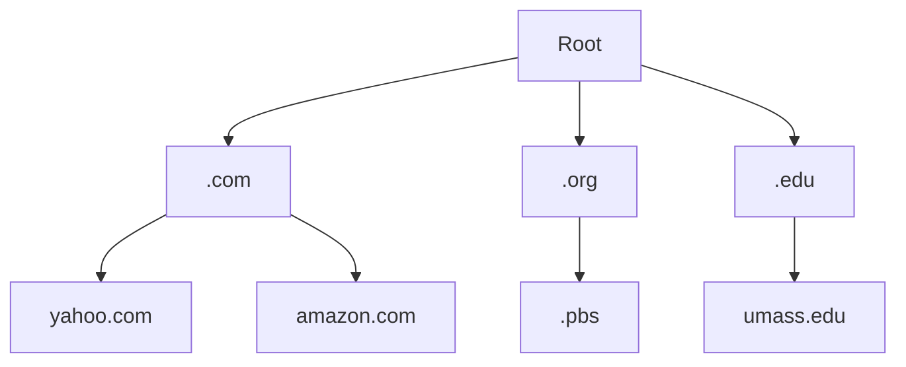

# Chapter 1 Networking Intro
## Overview 
1. What is internet, protocol ?
2. network edge: hosts, access network, physical media
3. network core:  packet/circuit switching, Internet structure
4. performance: loss, delay, efficiency
5. protocol layers and service models
6. security
7. history
## What is the Internet 
## Bolts & Nuts view
1. internet is a billion of devices and edge devices such as
	mobile, pc , fridge, weather toaster, ...
2. Packet switches: it forwards packets such as routers and switches
3. Communication links: Fiver, copper, radio, satellite, ....
4. Networks: collection of routers, devices, links which are all managed by an org.
5. Internet: network of networks => Interconnected ISPs
6. Protocols: a ways of sending and receiving messages
	ex: HTTP, TCP, Skype , Wi-Fi, 4G,...
7. Internet Standards: 
	1. RFC: Request for comment
	2. IETF: Internet engineering task force
## Service view
- Internet can be looked at as service view: it acts as infrastructure for all application
## Network Protocol
defines the format and order of messages send and received as well as defining the actions taken on sending and receiving

## <span style="color:rgb(255, 192, 0)">Network Edge</span>
## Hosts and Servers
they are clients and servers
	- hosts are called that because they are hosting network application
	- Servers often exist in data centers
## Access Networks and physical Media
they are connecting "end systems" AKA hosts to edge routers by residential access networks, Institutional access networks or mobile access networks (Wi-Fi , 4G, ...)

What to Look for : Transmission rate and Shared data between hosts
### Access network types
1. cable based access: one cable connects multiple houses with a splitter connecting multiple devices in the same house
   Notice that different house data are sent on the same cable at different frequencies <span style="color:rgb(255, 192, 0)">(Frequency division multiplexing FDM)</span> 
   - hybrid fiber coax (a=later in lecture 6)
	   - notice that wire based access is asymmetric meaning downstream bandwidth is higher than upstream bandwidth
2. <span style="color:rgb(255, 192, 0)">digital subscriber line DSL </span> : 
	we use telephone line to central office DSLAM (DSL Access Multiplier) 
		- Data over the DSL goes to the internet
		- Voice over the DSL goes the telephone net
<svg version="1.1" xmlns="http://www.w3.org/2000/svg" viewBox="0 0 637.8255481060041 334.70304212085904" width="637.8255481060041" height="334.70304212085904">
  <!-- svg-source:excalidraw -->
  
  <defs>
    <style class="style-fonts">
      @font-face {
        font-family: "Virgil";
        src: url("https://excalidraw.com/Virgil.woff2");
      }
      @font-face {
        font-family: "Cascadia";
        src: url("https://excalidraw.com/Cascadia.woff2");
      }
      @font-face {
        font-family: "Assistant";
        src: url("https://excalidraw.com/Assistant-Regular.woff2");
      }
    </style>
    
  </defs>
  <rect x="0" y="0" width="637.8255481060041" height="334.70304212085904" fill="#ffffff"></rect><g stroke-linecap="round" transform="translate(375.4256457622541 186.9030543278903) rotate(0 108.39999389648438 56.399993896484375)"><path d="M94.48 1.07 C108.3 -0.51, 125.97 1.09, 140.3 3.25 C154.64 5.41, 169.55 9.2, 180.49 14.04 C191.43 18.89, 199.79 25.48, 205.95 32.31 C212.12 39.14, 217.06 47.18, 217.5 55.03 C217.94 62.87, 214.41 72.21, 208.59 79.36 C202.77 86.51, 193.27 92.99, 182.6 97.93 C171.93 102.86, 158.44 106.38, 144.56 108.97 C130.69 111.56, 114.03 114.13, 99.34 113.48 C84.65 112.84, 69.38 108.9, 56.43 105.1 C43.48 101.31, 30.42 96.61, 21.64 90.72 C12.85 84.84, 6.92 77.19, 3.7 69.82 C0.47 62.45, -0.33 54.08, 2.28 46.52 C4.89 38.97, 11.05 30.79, 19.36 24.51 C27.67 18.23, 37.72 12.85, 52.16 8.84 C66.6 4.83, 95.33 1.76, 106.01 0.44 C116.69 -0.88, 116.1 0.04, 116.23 0.94 M94.34 -0.58 C107.88 -2.63, 123.52 -0.58, 137.65 1.99 C151.78 4.57, 167.73 9.98, 179.13 14.87 C190.52 19.76, 199.89 24.81, 206.02 31.35 C212.15 37.89, 215.36 46.39, 215.91 54.13 C216.46 61.88, 214.75 70.67, 209.32 77.83 C203.89 84.99, 194.2 91.69, 183.34 97.11 C172.48 102.52, 158.12 107.75, 144.17 110.33 C130.22 112.91, 114.35 113.47, 99.64 112.57 C84.92 111.68, 68.94 108.69, 55.88 104.97 C42.82 101.24, 30.1 96.16, 21.29 90.23 C12.48 84.3, 6.2 76.8, 3.02 69.42 C-0.16 62.03, -0.66 53.36, 2.23 45.92 C5.12 38.49, 12.01 31.21, 20.35 24.82 C28.7 18.43, 40.06 11.65, 52.32 7.58 C64.57 3.5, 86.89 1.24, 93.87 0.39 C100.85 -0.47, 93.98 1.71, 94.19 2.43" stroke="#1e1e1e" stroke-width="2" fill="none"></path></g><g stroke-linecap="round" transform="translate(420.2256945903791 219.70304212085904) rotate(0 30.800018310546875 16.400009155273438)"><path d="M21.46 1.39 C27.08 0.22, 35.78 0.89, 41.88 2.28 C47.99 3.68, 54.85 6.84, 58.1 9.77 C61.35 12.7, 62.74 16.73, 61.4 19.88 C60.07 23.03, 55.57 26.55, 50.09 28.65 C44.61 30.76, 35.17 32.41, 28.52 32.52 C21.87 32.63, 14.97 31.57, 10.19 29.33 C5.41 27.08, 0.75 22.64, -0.17 19.05 C-1.1 15.46, 0.63 10.78, 4.67 7.8 C8.7 4.82, 20.21 2.46, 24.02 1.17 C27.84 -0.13, 27.34 -0.16, 27.55 0.03 M43.96 0.57 C49.52 1.52, 55.19 5.55, 58.02 9.01 C60.85 12.48, 62.84 17.81, 60.94 21.36 C59.05 24.91, 52.42 28.58, 46.64 30.31 C40.86 32.04, 32.55 32.22, 26.28 31.75 C20.02 31.27, 13.34 30.08, 9.05 27.46 C4.77 24.84, 1.04 19.35, 0.59 16.02 C0.13 12.7, 2.48 10.27, 6.3 7.53 C10.13 4.79, 17.2 0.37, 23.53 -0.43 C29.87 -1.23, 40.83 2.55, 44.3 2.73 C47.77 2.92, 44.59 0.69, 44.35 0.66" stroke="#1e1e1e" stroke-width="2" fill="none"></path></g><g stroke-linecap="round"><g transform="translate(432.2256945903791 250.9030543278903) rotate(0 18.399993896484375 -12.800003051757812)"><path d="M-0.17 0.11 C5.73 -4.44, 29.97 -21.92, 36.2 -26.13 M-1.72 -0.88 C4.51 -4.77, 32.21 -20.47, 38.6 -24.87" stroke="#1e1e1e" stroke-width="2" fill="none"></path></g></g><mask></mask><g stroke-linecap="round"><g transform="translate(436.2256945903791 223.70304212085904) rotate(0 17.199981689453125 11.199996948242188)"><path d="M-1.19 -0.48 C4.51 3.26, 28.01 18.75, 33.99 22.48 M0.39 -1.78 C5.9 2.18, 27.22 19.93, 32.83 24.06" stroke="#1e1e1e" stroke-width="2" fill="none"></path></g></g><mask></mask><g stroke-linecap="round" transform="translate(498.22566407280095 216.10305127613248) rotate(0 30.800018310546875 16.400009155273438)"><path d="M30.26 0.56 C36.48 0.36, 45.09 1.22, 50.04 3.38 C55 5.55, 58.71 10.19, 60 13.56 C61.29 16.93, 60.68 20.55, 57.81 23.59 C54.94 26.63, 48.79 30.28, 42.78 31.81 C36.78 33.33, 28.03 33.75, 21.78 32.75 C15.53 31.76, 8.69 29.06, 5.27 25.81 C1.86 22.56, 0.62 16.94, 1.29 13.24 C1.97 9.55, 4.06 5.93, 9.32 3.64 C14.58 1.36, 28.41 -0.04, 32.85 -0.45 C37.29 -0.87, 36.02 0.9, 35.97 1.14 M37.23 0.83 C43.43 1.83, 52.52 4.86, 56.45 7.69 C60.37 10.52, 61.33 14.27, 60.8 17.82 C60.27 21.38, 57.6 26.57, 53.26 29.02 C48.92 31.46, 41.5 32.17, 34.76 32.5 C28.02 32.84, 18.55 32.9, 12.82 31.01 C7.09 29.12, 1.89 24.88, 0.38 21.15 C-1.14 17.42, 0.99 11.72, 3.72 8.64 C6.44 5.55, 11.08 4.23, 16.73 2.64 C22.38 1.05, 33.85 -0.36, 37.62 -0.92 C41.38 -1.47, 39.45 -0.93, 39.31 -0.67" stroke="#1e1e1e" stroke-width="2" fill="none"></path></g><g stroke-linecap="round"><g transform="translate(510.22566407280095 247.30306348316373) rotate(0 18.399993896484375 -12.800003051757812)"><path d="M-0.08 0.53 C5.91 -3.56, 29.51 -20.68, 35.77 -24.98 M-1.58 -0.24 C4.79 -4.64, 31.5 -22.85, 37.94 -26.78" stroke="#1e1e1e" stroke-width="2" fill="none"></path></g></g><mask></mask><g stroke-linecap="round"><g transform="translate(514.225664072801 220.10305127613248) rotate(0 17.199981689453125 11.199996948242188)"><path d="M-1.03 0.62 C4.83 4.32, 29.18 19.27, 35.06 22.72 M0.63 -0.1 C6.39 3.17, 28.99 17.08, 34.46 20.76" stroke="#1e1e1e" stroke-width="2" fill="none"></path></g></g><mask></mask><g stroke-linecap="round" transform="translate(460.62568848686345 258.50304517261685) rotate(0 30.800018310546875 16.400009155273438)"><path d="M39.38 1.53 C45.27 1.93, 51.5 3.33, 55.09 6.05 C58.68 8.78, 61.42 14.17, 60.93 17.88 C60.45 21.59, 56.64 25.84, 52.18 28.32 C47.73 30.8, 40.83 32.4, 34.22 32.74 C27.62 33.08, 17.99 32.51, 12.56 30.34 C7.13 28.17, 3.34 23.15, 1.64 19.72 C-0.07 16.3, -0.44 12.69, 2.33 9.78 C5.1 6.87, 11.38 3.58, 18.26 2.27 C25.14 0.95, 38.52 1.55, 43.61 1.89 C48.7 2.24, 48.89 4.18, 48.8 4.36 M20.96 2.04 C26.41 0.86, 34.42 -0.23, 40.71 0.79 C47 1.81, 55.55 4.76, 58.7 8.14 C61.86 11.51, 61.32 17.63, 59.65 21.06 C57.97 24.49, 53.8 26.76, 48.66 28.72 C43.52 30.68, 35.25 32.58, 28.79 32.83 C22.33 33.08, 14.85 32.44, 9.9 30.23 C4.95 28.03, -0.04 23.3, -0.89 19.6 C-1.73 15.91, 1.3 11.33, 4.81 8.05 C8.32 4.77, 17.56 0.95, 20.19 -0.08 C22.82 -1.11, 20.41 1.37, 20.61 1.87" stroke="#1e1e1e" stroke-width="2" fill="none"></path></g><g stroke-linecap="round"><g transform="translate(472.62568848686345 289.7030573796481) rotate(0 18.399993896484375 -12.800003051757812)"><path d="M0.62 0.91 C6.78 -3.25, 31.29 -20.13, 37.52 -24.72 M-0.52 0.35 C5.5 -4.16, 30.56 -22.02, 36.95 -26.38" stroke="#1e1e1e" stroke-width="2" fill="none"></path></g></g><mask></mask><g stroke-linecap="round"><g transform="translate(476.62568848686345 262.50304517261685) rotate(0 17.199981689453125 11.199996948242188)"><path d="M0.72 0.88 C6.55 4.29, 30.15 17.89, 35.59 21.36 M-0.36 0.29 C5.36 3.73, 29.26 18.62, 35.26 22.35" stroke="#1e1e1e" stroke-width="2" fill="none"></path></g></g><mask></mask><g stroke-linecap="round"><g transform="translate(503.4257067974103 233.30304822437466) rotate(0 -11.60003662109375 0)"><path d="M0.06 -0.27 C-3.69 -0.16, -19.12 0.35, -23 0.34 M-0.57 0.78 C-4.33 0.76, -19.49 -0.33, -23.32 -0.46" stroke="#1e1e1e" stroke-width="2" fill="none"></path></g></g><mask></mask><g stroke-linecap="round"><g transform="translate(533.0256823833479 249.30304822437466) rotate(0 -8.79998779296875 9.600006103515625)"><path d="M-1.09 0.03 C-3.92 3.49, -15.17 17.11, -18.09 20.39 M0.53 -1 C-2.39 2.19, -16.5 15.78, -19.3 18.9" stroke="#1e1e1e" stroke-width="2" fill="none"></path></g></g><mask></mask><g transform="translate(564.2256335552229 299.70304212085904) rotate(0 18.139984130859375 12.5)"><text x="0" y="17.52" font-family="Virgil, Segoe UI Emoji" font-size="20px" fill="#1e1e1e" text-anchor="start" style="white-space: pre;" direction="ltr" dominant-baseline="alphabetic">ISP</text></g><g stroke-linecap="round"><g transform="translate(567.4257067974104 276.5030604314059) rotate(0 0 0)"><path d="M0.16 0.35 C0.2 0.28, 0.34 -0.15, 0.32 -0.25 M-0.19 0.22 C-0.17 0.18, 0.2 0.1, 0.21 0.08" stroke="#1e1e1e" stroke-width="2" fill="none"></path></g></g><mask></mask><g stroke-linecap="round"><g transform="translate(584.2256335552229 291.70304212085904) rotate(0 -12.79998779296875 -12)"><path d="M0.47 -1 C-3.77 -5.14, -20.71 -19.69, -25.19 -23.68 M-0.75 1.08 C-5.13 -2.92, -22.06 -21.43, -25.92 -25.63" stroke="#1e1e1e" stroke-width="2" fill="none"></path></g><g transform="translate(584.2256335552229 291.70304212085904) rotate(0 -12.79998779296875 -12)"><path d="M-10.34 -17.55 C-16.89 -19.48, -19.96 -23.83, -25.92 -25.63 M-10.34 -17.55 C-13.61 -18.81, -16.35 -21.57, -25.92 -25.63" stroke="#1e1e1e" stroke-width="2" fill="none"></path></g><g transform="translate(584.2256335552229 291.70304212085904) rotate(0 -12.79998779296875 -12)"><path d="M-19.18 -9.43 C-22.97 -14.01, -23.2 -20.97, -25.92 -25.63 M-19.18 -9.43 C-20.45 -12.56, -21.23 -17.11, -25.92 -25.63" stroke="#1e1e1e" stroke-width="2" fill="none"></path></g></g><mask></mask><g stroke-linecap="round" transform="translate(319.4256457622541 14.903039069101226) rotate(0 84.00003051757812 75.20000457763672)"><path d="M52.76 6.38 C62.27 1.42, 75.44 -0.49, 86.79 -0.38 C98.14 -0.26, 110.74 2.44, 120.87 7.06 C130.99 11.68, 140.39 19.46, 147.55 27.35 C154.72 35.25, 160.61 44.89, 163.86 54.43 C167.1 63.98, 168.5 74.53, 167.01 84.62 C165.53 94.7, 160.9 106.27, 154.96 114.94 C149.01 123.61, 140.64 130.87, 131.35 136.64 C122.06 142.4, 110.57 147.76, 99.21 149.54 C87.85 151.32, 74.3 149.68, 63.18 147.3 C52.06 144.92, 41.2 141.31, 32.48 135.25 C23.76 129.19, 16.33 119.95, 10.86 110.94 C5.39 101.94, 0.79 91.37, -0.35 81.23 C-1.49 71.1, 0.19 59.77, 4.02 50.13 C7.86 40.5, 12.44 31.32, 22.66 23.42 C32.88 15.51, 56.04 6.32, 65.32 2.68 C74.59 -0.96, 77.98 0.43, 78.29 1.6 M81.91 0.37 C92.55 -1.42, 105.31 0.6, 115.84 4.5 C126.37 8.4, 137.34 15.98, 145.09 23.76 C152.83 31.54, 158.4 41.41, 162.31 51.16 C166.23 60.9, 169.27 72.2, 168.58 82.23 C167.9 92.27, 163.87 102.46, 158.23 111.34 C152.59 120.21, 143.82 129.42, 134.75 135.48 C125.69 141.53, 115.05 145.32, 103.84 147.68 C92.62 150.04, 78.56 151.66, 67.46 149.66 C56.36 147.65, 46.28 141.69, 37.23 135.65 C28.19 129.61, 19.38 121.98, 13.19 113.42 C6.99 104.86, 1.53 94.12, 0.07 84.31 C-1.38 74.49, 0.85 64.13, 4.45 54.54 C8.05 44.95, 14.28 34.51, 21.65 26.78 C29.02 19.05, 38.78 12.81, 48.66 8.16 C58.53 3.52, 75.24 -0.13, 80.89 -1.09 C86.54 -2.05, 82.12 0.91, 82.57 2.42" stroke="#1e1e1e" stroke-width="2" fill="none"></path></g><g stroke-linecap="round"><g transform="translate(433.8256701763166 222.9030543278903) rotate(0 -28.800018310546875 -44.80000305175781)"><path d="M-1.08 -0.6 C-10.61 -15.48, -46.94 -74.5, -56.56 -89.46 M0.56 1.7 C-9.09 -12.94, -47.45 -72.66, -56.97 -87.84" stroke="#1e1e1e" stroke-width="2" fill="none"></path></g></g><mask></mask><g stroke-linecap="round"><g transform="translate(340.2256945903791 58.903039069101226) rotate(0 19.5999755859375 11.200004577636719)"><path d="M-0.45 0.02 C6.11 3.82, 32.47 18.45, 39.23 21.98 M1.52 -1.02 C7.92 3.03, 31.92 19.47, 38.3 23.3" stroke="#1e1e1e" stroke-width="2" fill="none"></path></g></g><mask></mask><g stroke-linecap="round"><g transform="translate(381.0256823833478 82.10303601734341) rotate(0 -18.4000244140625 21.20001220703125)"><path d="M-0.48 0.46 C0 7.06, 6.32 30.03, 2.24 40.28 C-1.85 50.53, -18.2 71.56, -24.97 61.96 C-31.75 52.36, -36.05 -3.74, -38.4 -17.32 M1.47 -0.34 C1.83 6.36, 5.21 31.45, 1.2 41.54 C-2.81 51.64, -16.1 70.37, -22.59 60.23 C-29.08 50.09, -34.75 -5.99, -37.73 -19.31" stroke="#1e1e1e" stroke-width="2" fill="none"></path></g></g><mask></mask><g stroke-linecap="round"><g transform="translate(153.02568238334783 10.903039069101226) rotate(0 18.399993896484375 138.80001068115234)"><path d="M0.73 -0.9 C-17.82 16.07, -92.11 54.57, -112.2 101.08 C-132.29 147.58, -163.78 248.77, -119.82 278.12 C-75.87 307.46, 105.47 308.28, 151.52 277.14 C197.57 246, 181.76 137.38, 156.46 91.26 C131.17 45.15, 25.8 15.57, -0.23 0.46 M-0.35 1.24 C-18.92 18.44, -92.74 56.54, -112.83 102.34 C-132.93 148.14, -164.98 246.77, -120.92 276.05 C-76.86 305.32, 105.49 308.73, 151.51 278 C197.54 247.27, 180.31 138.08, 155.24 91.69 C130.16 45.3, 26.75 15.02, 1.06 -0.34" stroke="#1e1e1e" stroke-width="2" fill="none"></path></g></g><mask></mask><g stroke-linecap="round"><g transform="translate(349.8256701763166 102.10303601734341) rotate(0 -39.600006103515625 18)"><path d="M0.05 -0.3 C-13.15 5.83, -66.55 31.04, -79.81 37.12 M-1.38 -1.51 C-14.13 4.29, -64.24 29.08, -77.41 35.58" stroke="#1e1e1e" stroke-width="2" fill="none"></path></g></g><mask></mask><g stroke-linecap="round" transform="translate(220.22563355522283 98.90305432789029) rotate(0 25.600006103515625 28.399993896484375)"><path d="M12.8 0 C22.37 1.95, 28.56 0.16, 38.4 0 M12.8 0 C21.93 -0.54, 31.67 -0.25, 38.4 0 M38.4 0 C47.87 -1.64, 50.8 2.3, 51.2 12.8 M38.4 0 C49.01 -1.82, 51.5 4.92, 51.2 12.8 M51.2 12.8 C50.63 23.55, 49.9 31.33, 51.2 44 M51.2 12.8 C50.65 22.67, 51.19 33.4, 51.2 44 M51.2 44 C50.25 51.08, 47.09 57.65, 38.4 56.8 M51.2 44 C51.25 52.82, 47.8 55.14, 38.4 56.8 M38.4 56.8 C29.04 57.84, 17.25 58.51, 12.8 56.8 M38.4 56.8 C29.79 57.06, 19.98 56.64, 12.8 56.8 M12.8 56.8 C3.55 55.92, 0.37 51.06, 0 44 M12.8 56.8 C4.64 57.48, -1.18 50.73, 0 44 M0 44 C-2.05 32.96, 1.24 22.09, 0 12.8 M0 44 C-0.44 34.65, 0.44 25.79, 0 12.8 M0 12.8 C1.98 2.74, 4.36 1.27, 12.8 0 M0 12.8 C0.99 3.84, 4.6 -1.65, 12.8 0" stroke="#1e1e1e" stroke-width="2" fill="none"></path></g><g stroke-linecap="round"><g transform="translate(220.22569459037908 134.1030360173434) rotate(0 -31.600006103515625 39.20001220703125)"><path d="M-0.94 0.6 C-11.47 13.75, -52.28 65.37, -62.85 78.33 M0.77 -0.14 C-9.92 13.27, -53.13 66.54, -63.61 79.83" stroke="#1e1e1e" stroke-width="2" fill="none"></path></g></g><mask></mask><g stroke-linecap="round"><g transform="translate(219.42564576225408 121.30304822437466) rotate(0 -39.5999755859375 -0.8000030517578125)"><path d="M-0.29 -1.01 C-13.41 -1.2, -66.1 -1.35, -79.36 -1.37 M1.76 1.08 C-11.47 0.53, -66.61 -2.65, -80.39 -3.38" stroke="#1e1e1e" stroke-width="2" fill="none"></path></g></g><mask></mask><g transform="translate(59.42564576225408 116.50306043140591) rotate(0 47.159950256347656 12.5)"><text x="0" y="17.52" font-family="Virgil, Segoe UI Emoji" font-size="20px" fill="#1e1e1e" text-anchor="start" style="white-space: pre;" direction="ltr" dominant-baseline="alphabetic">Telephone</text></g><g transform="translate(73.82567017631658 211.70304212085904) rotate(0 33.70996856689453 12.5)"><text x="0" y="17.52" font-family="Virgil, Segoe UI Emoji" font-size="20px" fill="#1e1e1e" text-anchor="start" style="white-space: pre;" direction="ltr" dominant-baseline="alphabetic">Laptop</text></g><g transform="translate(231.62565796928533 199.70304212085904) rotate(0 36.89995574951172 12.5)"><text x="0" y="17.52" font-family="Virgil, Segoe UI Emoji" font-size="20px" fill="#1e1e1e" text-anchor="start" style="white-space: pre;" direction="ltr" dominant-baseline="alphabetic">Splitter</text></g><g stroke-linecap="round"><g transform="translate(267.4256457622541 190.1030360173434) rotate(0 -8.79998779296875 -26.399993896484375)"><path d="M-0.28 0.59 C-3.29 -7.99, -15.57 -43.54, -18.5 -52.49 M1.77 -0.15 C-0.82 -9.01, -12.85 -45.82, -16.25 -54.45" stroke="#1e1e1e" stroke-width="2" fill="none"></path></g><g transform="translate(267.4256457622541 190.1030360173434) rotate(0 -8.79998779296875 -26.399993896484375)"><path d="M-0.35 -35.16 C-3.36 -41.72, -7.96 -45.61, -16.25 -54.45 M-0.35 -35.16 C-4.8 -39.7, -8.48 -46.36, -16.25 -54.45" stroke="#1e1e1e" stroke-width="2" fill="none"></path></g><g transform="translate(267.4256457622541 190.1030360173434) rotate(0 -8.79998779296875 -26.399993896484375)"><path d="M-16.47 -29.45 C-15.22 -37.46, -15.63 -42.84, -16.25 -54.45 M-16.47 -29.45 C-16.53 -35.59, -15.79 -43.83, -16.25 -54.45" stroke="#1e1e1e" stroke-width="2" fill="none"></path></g></g><mask></mask><g transform="translate(393.8256091411603 41.30304822437466) rotate(0 35.82997131347656 25)"><text x="0" y="17.52" font-family="Virgil, Segoe UI Emoji" font-size="20px" fill="#1e1e1e" text-anchor="start" style="white-space: pre;" direction="ltr" dominant-baseline="alphabetic">Central</text><text x="0" y="42.519999999999996" font-family="Virgil, Segoe UI Emoji" font-size="20px" fill="#1e1e1e" text-anchor="start" style="white-space: pre;" direction="ltr" dominant-baseline="alphabetic">Office</text></g><g transform="translate(512.2256335552229 111.70304212085904) rotate(0 57.799957275390625 37.5)"><text x="0" y="17.52" font-family="Virgil, Segoe UI Emoji" font-size="20px" fill="#1e1e1e" text-anchor="start" style="white-space: pre;" direction="ltr" dominant-baseline="alphabetic">DSLAM</text><text x="0" y="42.519999999999996" font-family="Virgil, Segoe UI Emoji" font-size="20px" fill="#1e1e1e" text-anchor="start" style="white-space: pre;" direction="ltr" dominant-baseline="alphabetic">DSL Access</text><text x="0" y="67.52" font-family="Virgil, Segoe UI Emoji" font-size="20px" fill="#1e1e1e" text-anchor="start" style="white-space: pre;" direction="ltr" dominant-baseline="alphabetic">Multiplexer</text></g><g stroke-linecap="round"><g transform="translate(509.8257312114728 143.70304212085904) rotate(0 -68.4000244140625 -17.599990844726562)"><path d="M0.3 -0.31 C-22.8 -6.23, -114.63 -29.31, -137.62 -35.06 M-1.01 -1.52 C-23.8 -7.26, -112.97 -27.54, -135.33 -33.45" stroke="#1e1e1e" stroke-width="2" fill="none"></path></g><g transform="translate(509.8257312114728 143.70304212085904) rotate(0 -68.4000244140625 -17.599990844726562)"><path d="M-110.49 -36.2 C-120.4 -36.45, -129.05 -35.46, -135.33 -33.45 M-110.49 -36.2 C-118.45 -35.8, -126.32 -34.77, -135.33 -33.45" stroke="#1e1e1e" stroke-width="2" fill="none"></path></g><g transform="translate(509.8257312114728 143.70304212085904) rotate(0 -68.4000244140625 -17.599990844726562)"><path d="M-114.53 -19.58 C-122.98 -26.14, -130.1 -31.44, -135.33 -33.45 M-114.53 -19.58 C-121.11 -24.74, -127.65 -29.22, -135.33 -33.45" stroke="#1e1e1e" stroke-width="2" fill="none"></path></g></g><mask></mask></svg>
Notice that here you are not sharing the same wire for internet with your neighbors as opposed to the cable based access
Notice that the  DSL access network is also asymmetric like the cable network
- it has speed (42-52) Mbps downstream and (4-16) Mbps upstream
		<span style="color:rgb(255, 192, 0)">3. Access Network : home network</span> 
<svg version="1.1" xmlns="http://www.w3.org/2000/svg" viewBox="0 0 582.4712953876704 352.86932773679496" width="582.4712953876704" height="352.86932773679496">
  <!-- svg-source:excalidraw -->
  
  <defs>
    <style class="style-fonts">
      @font-face {
        font-family: "Virgil";
        src: url("https://excalidraw.com/Virgil.woff2");
      }
      @font-face {
        font-family: "Cascadia";
        src: url("https://excalidraw.com/Cascadia.woff2");
      }
      @font-face {
        font-family: "Assistant";
        src: url("https://excalidraw.com/Assistant-Regular.woff2");
      }
    </style>
    
  </defs>
  <rect x="0" y="0" width="582.4712953876704" height="352.86932773679496" fill="#ffffff"></rect><g stroke-linecap="round"><g transform="translate(224.57140830270947 10.080952320862565) rotate(0 -106.79998779296875 56.80000305175781)"><path d="M-0.3 0.63 C-36.07 19.4, -179.02 93.9, -214.57 112.77 M1.75 -0.08 C-33.67 18.8, -176.35 94.64, -212.37 113.87" stroke="#1e1e1e" stroke-width="2" fill="none"></path></g></g><mask></mask><g stroke-linecap="round"><g transform="translate(227.77142050974072 10.88097063140944) rotate(0 83.60000610351562 50.399993896484375)"><path d="M-0.37 0.66 C27.24 17.56, 138.12 85.2, 166.11 101.89 M1.64 -0.03 C29.57 16.5, 140.69 83.31, 168.26 100.34" stroke="#1e1e1e" stroke-width="2" fill="none"></path></g></g><mask></mask><g stroke-linecap="round"><g transform="translate(401.3713960956782 121.28096452789381) rotate(0 0.800018310546875 105.19999694824219)"><path d="M-0.4 -0.73 C-0.25 34.24, 1.53 175.54, 2 210.74 M1.59 1.5 C1.51 36.01, 1.18 173.75, 1.26 208.79" stroke="#1e1e1e" stroke-width="2" fill="none"></path></g></g><mask></mask><g stroke-linecap="round"><g transform="translate(10.971402199193847 130.08095232086256) rotate(0 2 100.40000915527344)"><path d="M-0.37 0.48 C0.08 34.09, 2.21 167.59, 3.03 200.93 M1.63 -0.32 C2.43 33.58, 4.83 168.86, 5.24 202.54" stroke="#1e1e1e" stroke-width="2" fill="none"></path></g></g><mask></mask><g stroke-linecap="round"><g transform="translate(397.3713960956782 333.28099504547197) rotate(0 -187.59999084472656 4.399993896484375)"><path d="M0.15 0.96 C-62.31 2.15, -312.76 6.83, -375.5 8.31 M-1.23 0.42 C-63.81 2.28, -314.48 8.32, -376.61 9.59" stroke="#1e1e1e" stroke-width="2" fill="none"></path></g></g><mask></mask><g stroke-linecap="round" transform="translate(306.971432716772 218.88097063140944) rotate(0 32 12)"><path d="M6 0 C26.71 1.07, 45.21 0.58, 58 0 M6 0 C25.34 0.11, 42.62 1.28, 58 0 M58 0 C63.87 -1.67, 65.84 3.52, 64 6 M58 0 C61.34 -1.45, 62.64 3.46, 64 6 M64 6 C63.46 9.99, 62.85 13.87, 64 18 M64 6 C63.97 10.13, 64 15.43, 64 18 M64 18 C65.49 23.79, 63.27 23, 58 24 M64 18 C66.07 22.73, 61.21 22.87, 58 24 M58 24 C39.8 24, 18.4 23.22, 6 24 M58 24 C41.66 23.87, 27.79 22.8, 6 24 M6 24 C2.92 24.09, -1.09 20.89, 0 18 M6 24 C3.41 22.96, -1.65 20.46, 0 18 M0 18 C-0.86 14.77, -0.72 12.06, 0 6 M0 18 C-0.42 14.84, -0.28 12.53, 0 6 M0 6 C0.19 2.57, 1.52 -1.87, 6 0 M0 6 C0.01 3, 1.09 -1.21, 6 0" stroke="#1e1e1e" stroke-width="2" fill="none"></path></g><g stroke-linecap="round" transform="translate(180.57140830270947 209.28099504547194) rotate(0 40 22)"><path d="M34.71 0.65 C42 -0.18, 53.18 1.52, 60.02 3.61 C66.87 5.69, 72.44 9.44, 75.81 13.18 C79.17 16.92, 81.57 22.05, 80.2 26.05 C78.83 30.04, 73.29 34.12, 67.6 37.15 C61.91 40.19, 53.74 43.59, 46.08 44.26 C38.42 44.93, 28.66 43.36, 21.62 41.18 C14.58 39, 7.37 35.03, 3.83 31.19 C0.29 27.35, -1.23 22.41, 0.36 18.16 C1.96 13.91, 6.29 8.63, 13.42 5.68 C20.54 2.73, 37.03 1.36, 43.12 0.47 C49.21 -0.43, 49.91 -0.04, 49.96 0.32 M44.89 -0.64 C52.69 -0.66, 61.54 3.23, 67.27 6.35 C73.01 9.46, 77.78 14.13, 79.31 18.05 C80.83 21.96, 79.65 26.16, 76.42 29.84 C73.18 33.53, 66.4 37.91, 59.87 40.17 C53.35 42.43, 45.01 43.63, 37.28 43.42 C29.55 43.21, 19.73 41.44, 13.49 38.91 C7.25 36.39, 1.4 32.57, -0.13 28.26 C-1.66 23.95, 1.26 17.41, 4.3 13.06 C7.34 8.7, 11.72 4.48, 18.13 2.14 C24.54 -0.2, 38.6 -0.86, 42.76 -0.96 C46.92 -1.06, 42.96 0.82, 43.08 1.55" stroke="#1e1e1e" stroke-width="2" fill="none"></path></g><g stroke-linecap="round" transform="translate(70.97143271677197 217.2809340103157) rotate(0 34 18)"><path d="M9 0 C23.69 1.68, 35.23 1.87, 59 0 M9 0 C28.1 -0.82, 46.26 0.69, 59 0 M59 0 C64.53 0.1, 68.16 3.66, 68 9 M59 0 C66.61 -0.65, 69.42 3.11, 68 9 M68 9 C66.67 16.68, 69.35 20.8, 68 27 M68 9 C68.26 15.84, 68.61 21.56, 68 27 M68 27 C69.38 32.59, 63.53 34.77, 59 36 M68 27 C67.47 33.58, 64.18 34.46, 59 36 M59 36 C45.55 35.72, 33.39 35.41, 9 36 M59 36 C44.7 36.46, 30.46 35.13, 9 36 M9 36 C3.73 34.08, -1.99 31.91, 0 27 M9 36 C3.52 37.88, -1.99 31.69, 0 27 M0 27 C-0.87 21.62, -0.06 13.19, 0 9 M0 27 C0.59 21.78, 0.21 17.77, 0 9 M0 9 C0.18 4.88, 2.82 1.17, 9 0 M0 9 C0.88 3.96, 4.17 -1.36, 9 0" stroke="#1e1e1e" stroke-width="2" fill="none"></path></g><g stroke-linecap="round"><g transform="translate(83.77142050974072 232.48097673492506) rotate(0 -0.399993896484375 -16.400009155273438)"><path d="M0.5 -0.38 C0.5 -5.89, -0.33 -27.66, -0.54 -33.05 M0.09 0.61 C0.08 -4.83, -0.65 -27.03, -0.83 -32.48" stroke="#1e1e1e" stroke-width="2" fill="none"></path></g></g><mask></mask><g stroke-linecap="round"><g transform="translate(120.57140830270947 233.28096452789381) rotate(0 0.399993896484375 -17.199996948242188)"><path d="M-0.12 0.05 C0.1 -5.75, 0.88 -29.01, 1.09 -34.79 M0.81 -0.4 C1 -6.15, 0.78 -28.67, 0.81 -34.28" stroke="#1e1e1e" stroke-width="2" fill="none"></path></g></g><mask></mask><g stroke-linecap="round"><g transform="translate(80.57140830270947 179.6809584243782) rotate(0 -10.800003051757812 16.400009155273438)"><path d="M0.53 0.63 C-3.4 4.17, -20.5 16.54, -22.69 21.88 C-24.88 27.21, -14.28 30.87, -12.61 32.65 M-0.65 -0.08 C-4.31 3.09, -18.37 14.66, -20.55 20.32 C-22.72 25.98, -14.99 31.69, -13.7 33.89" stroke="#1e1e1e" stroke-width="2" fill="none"></path></g></g><mask></mask><g stroke-linecap="round"><g transform="translate(152.59854019845076 181.17706612501294) rotate(150.18157712366508 -10.800003051757812 16.400009155273438)"><path d="M0.07 1.2 C-3.54 4.99, -18.93 16.9, -21.12 21.99 C-23.31 27.07, -14.6 29.92, -13.08 31.71 M-1.36 0.78 C-5.13 4.34, -20.25 15.21, -21.81 20.49 C-23.37 25.76, -12.43 30.24, -10.75 32.46" stroke="#1e1e1e" stroke-width="2" fill="none"></path></g></g><mask></mask><g stroke-linecap="round" transform="translate(16.571438820287597 156.48097673492506) rotate(0 197.99998474121094 70)"><path d="M244.54 1.77 C264.13 2.32, 283.51 5.85, 300.98 9.68 C318.45 13.51, 336.12 19.12, 349.37 24.76 C362.62 30.4, 372.75 36.89, 380.47 43.51 C388.19 50.12, 394.12 57.32, 395.69 64.44 C397.25 71.56, 394.65 79.15, 389.86 86.22 C385.08 93.28, 377.51 100.57, 366.97 106.83 C356.42 113.09, 342.21 119.04, 326.58 123.77 C310.95 128.49, 291.9 132.47, 273.2 135.18 C254.5 137.88, 234.62 139.36, 214.38 140 C194.13 140.65, 171.65 140.89, 151.75 139.06 C131.86 137.24, 112.5 132.98, 95 129.05 C77.51 125.13, 60.17 120.91, 46.79 115.52 C33.41 110.14, 22.45 103.57, 14.73 96.74 C7.01 89.91, 1.94 81.65, 0.48 74.54 C-0.98 67.44, 1.25 61.08, 5.97 54.11 C10.68 47.15, 18.32 38.83, 28.77 32.76 C39.22 26.68, 53.23 22.34, 68.69 17.65 C84.16 12.96, 102.65 7.57, 121.54 4.62 C140.43 1.67, 159.87 0.35, 182.01 -0.04 C204.16 -0.43, 240.91 1.52, 254.42 2.29 C267.92 3.06, 263.99 3.22, 263.04 4.6 M273.44 5.21 C292.41 6.6, 310.1 10.99, 325.55 15.92 C341 20.86, 355.24 28.41, 366.14 34.81 C377.05 41.21, 386.35 47.41, 391 54.3 C395.65 61.19, 395.95 69.21, 394.04 76.14 C392.13 83.08, 387.11 89.27, 379.53 95.91 C371.95 102.55, 361.51 110.3, 348.57 116.01 C335.62 121.71, 319.3 126.26, 301.87 130.16 C284.43 134.06, 263.83 137.84, 243.96 139.39 C224.09 140.95, 203.16 140.41, 182.65 139.48 C162.14 138.54, 139.97 136.43, 120.92 133.79 C101.86 131.15, 83.5 128.27, 68.32 123.63 C53.13 119, 40.32 112.47, 29.81 105.98 C19.3 99.48, 10.32 91.49, 5.25 84.66 C0.19 77.83, -2.33 71.8, -0.58 65.01 C1.18 58.23, 7.54 50.52, 15.78 43.96 C24.02 37.39, 35.43 31.04, 48.87 25.61 C62.3 20.18, 79.2 15.55, 96.39 11.36 C113.58 7.18, 132.29 2.17, 152.01 0.51 C171.72 -1.15, 194.57 0.63, 214.7 1.41 C234.83 2.18, 263.37 4.1, 272.81 5.17 C282.24 6.23, 272.33 6.44, 271.3 7.77" stroke="#1e1e1e" stroke-width="2" fill="none"></path></g><g transform="translate(86.97143271677197 311.6809584243782) rotate(0 107.70991516113281 12.5)"><text x="0" y="17.52" font-family="Virgil, Segoe UI Emoji" font-size="20px" fill="#1e1e1e" text-anchor="start" style="white-space: pre;" direction="ltr" dominant-baseline="alphabetic">All in the same device</text></g><g transform="translate(275.771481544897 171.6809584243782) rotate(0 55.559959411621094 25)"><text x="0" y="17.52" font-family="Virgil, Segoe UI Emoji" font-size="20px" fill="#1e1e1e" text-anchor="start" style="white-space: pre;" direction="ltr" dominant-baseline="alphabetic">Cable or </text><text x="0" y="42.519999999999996" font-family="Virgil, Segoe UI Emoji" font-size="20px" fill="#1e1e1e" text-anchor="start" style="white-space: pre;" direction="ltr" dominant-baseline="alphabetic">DSL Modem</text></g><g transform="translate(178.97143271677197 161.28096452789381) rotate(0 45.77995300292969 25)"><text x="0" y="17.52" font-family="Virgil, Segoe UI Emoji" font-size="20px" fill="#1e1e1e" text-anchor="start" style="white-space: pre;" direction="ltr" dominant-baseline="alphabetic">Firewall</text><text x="0" y="42.519999999999996" font-family="Virgil, Segoe UI Emoji" font-size="20px" fill="#1e1e1e" text-anchor="start" style="white-space: pre;" direction="ltr" dominant-baseline="alphabetic">or router</text></g><g stroke-linecap="round"><g transform="translate(179.77142050974072 238.08095232086256) rotate(0 -18 0)"><path d="M0.34 -0.11 C-5.69 0.04, -30.38 0.43, -36.45 0.52 M-0.15 -0.64 C-5.99 -0.6, -29.39 -0.22, -35.44 -0.18" stroke="#1e1e1e" stroke-width="2" fill="none"></path></g><g transform="translate(179.77142050974072 238.08095232086256) rotate(0 -18 0)"><path d="M-18.6 -6.53 C-22.96 -5.64, -26.11 -3.48, -35.44 -0.18 M-18.6 -6.53 C-24.59 -4.44, -31.38 -1.78, -35.44 -0.18" stroke="#1e1e1e" stroke-width="2" fill="none"></path></g><g transform="translate(179.77142050974072 238.08095232086256) rotate(0 -18 0)"><path d="M-18.46 5.78 C-22.81 3.62, -25.99 2.74, -35.44 -0.18 M-18.46 5.78 C-24.51 3.21, -31.35 1.22, -35.44 -0.18" stroke="#1e1e1e" stroke-width="2" fill="none"></path></g></g><mask></mask><g stroke-linecap="round"><g transform="translate(187.77142050974072 218.88097063140944) rotate(0 -15.600006103515625 -46.40000915527344)"><path d="M0.18 -0.58 C-4.95 -16.13, -24.86 -77.81, -30.27 -93.03 M-1.19 1.74 C-6.44 -13.67, -25.93 -75.7, -30.72 -91.62" stroke="#1e1e1e" stroke-width="2" fill="none"></path></g><g transform="translate(187.77142050974072 218.88097063140944) rotate(0 -15.600006103515625 -46.40000915527344)"><path d="M-15.62 -71.7 C-21.79 -76.93, -26.39 -87.08, -30.72 -91.62 M-15.62 -71.7 C-21.28 -78.33, -27.05 -86.94, -30.72 -91.62" stroke="#1e1e1e" stroke-width="2" fill="none"></path></g><g transform="translate(187.77142050974072 218.88097063140944) rotate(0 -15.600006103515625 -46.40000915527344)"><path d="M-31.96 -66.65 C-32.56 -73.63, -31.57 -85.51, -30.72 -91.62 M-31.96 -66.65 C-31.5 -75.13, -31.16 -85.63, -30.72 -91.62" stroke="#1e1e1e" stroke-width="2" fill="none"></path></g></g><mask></mask><g stroke-linecap="round" transform="translate(123.77142050974072 74.08095232086256) rotate(0 22.79998779296875 17.5)"><path d="M8.75 0 C18.34 1.7, 24.4 -1.52, 36.85 0 M8.75 0 C17.99 0.24, 27.55 0.44, 36.85 0 M36.85 0 C43.12 -1.89, 47.12 1.68, 45.6 8.75 M36.85 0 C41.91 -2.01, 46.03 4.33, 45.6 8.75 M45.6 8.75 C44.05 15.98, 44.67 21.34, 45.6 26.25 M45.6 8.75 C45.77 12.08, 45.43 16.7, 45.6 26.25 M45.6 26.25 C44.7 33, 42.14 33.4, 36.85 35 M45.6 26.25 C45.12 31.72, 44.56 34.07, 36.85 35 M36.85 35 C30.03 35.54, 23.49 33.64, 8.75 35 M36.85 35 C29.17 36.04, 20.69 34.51, 8.75 35 M8.75 35 C4.84 34.64, -0.59 32.71, 0 26.25 M8.75 35 C3.5 32.77, 1.81 30.45, 0 26.25 M0 26.25 C0.35 22.69, -0.36 17.44, 0 8.75 M0 26.25 C0.25 20.58, -0.15 15.71, 0 8.75 M0 8.75 C-0.09 2.97, 2.99 -0.29, 8.75 0 M0 8.75 C-1.53 3.99, 1.56 -1.11, 8.75 0" stroke="#1e1e1e" stroke-width="2" fill="none"></path></g><g transform="translate(133.52142050974072 79.08095232086256) rotate(0 13.04998779296875 12.5)"><text x="13.04998779296875" y="17.52" font-family="Virgil, Segoe UI Emoji" font-size="20px" fill="#1e1e1e" text-anchor="middle" style="white-space: pre;" direction="ltr" dominant-baseline="alphabetic">PC</text></g><g transform="translate(186.97143271677197 102.13622940146485) rotate(0 102.21988677978516 20.572367563214502)"><text x="0" y="14.41711518830073" font-family="Virgil, Segoe UI Emoji" font-size="16.45789405057161px" fill="#1e1e1e" text-anchor="start" style="white-space: pre;" direction="ltr" dominant-baseline="alphabetic">Router gives internet</text><text x="0" y="34.98948275151524" font-family="Virgil, Segoe UI Emoji" font-size="16.45789405057161px" fill="#1e1e1e" text-anchor="start" style="white-space: pre;" direction="ltr" dominant-baseline="alphabetic"> through ethernet or Wifi</text></g><g stroke-linecap="round"><g transform="translate(308.5714083027095 230.88097063140944) rotate(0 -23.600006103515625 -2)"><path d="M0.13 -0.05 C-7.66 -0.83, -38.93 -3.73, -46.91 -4.34 M-0.47 -0.56 C-8.29 -1.29, -39.49 -3.13, -47.19 -3.82" stroke="#1e1e1e" stroke-width="2" fill="none"></path></g><g transform="translate(308.5714083027095 230.88097063140944) rotate(0 -23.600006103515625 -2)"><path d="M-24.41 -10.29 C-30.6 -8, -37.25 -7.75, -47.19 -3.82 M-24.41 -10.29 C-32.66 -8.15, -40.24 -5.99, -47.19 -3.82" stroke="#1e1e1e" stroke-width="2" fill="none"></path></g><g transform="translate(308.5714083027095 230.88097063140944) rotate(0 -23.600006103515625 -2)"><path d="M-25.58 5.87 C-31.5 3.82, -37.83 -0.27, -47.19 -3.82 M-25.58 5.87 C-33.5 2.48, -40.67 -0.89, -47.19 -3.82" stroke="#1e1e1e" stroke-width="2" fill="none"></path></g></g><mask></mask><g stroke-linecap="round"><g transform="translate(473.3713960956782 228.48097673492506) rotate(0 -46 0.79998779296875)"><path d="M-0.89 0.82 C-16.24 1.24, -75.87 2.12, -90.93 2.23 M0.84 0.21 C-14.68 0.3, -75.91 0.01, -91.32 0.44" stroke="#1e1e1e" stroke-width="2" fill="none"></path></g><g transform="translate(473.3713960956782 228.48097673492506) rotate(0 -46 0.79998779296875)"><path d="M-67.91 -8.33 C-75.85 -3.24, -85.46 -0.29, -91.32 0.44 M-67.91 -8.33 C-75.63 -4.6, -80.67 -3.52, -91.32 0.44" stroke="#1e1e1e" stroke-width="2" fill="none"></path></g><g transform="translate(473.3713960956782 228.48097673492506) rotate(0 -46 0.79998779296875)"><path d="M-67.75 8.77 C-75.71 7.07, -85.39 3.23, -91.32 0.44 M-67.75 8.77 C-75.61 7.49, -80.7 3.57, -91.32 0.44" stroke="#1e1e1e" stroke-width="2" fill="none"></path></g></g><mask></mask><g transform="translate(427.7714205097407 206.08095232086256) rotate(0 72.34993743896484 37.5)"><text x="0" y="17.52" font-family="Virgil, Segoe UI Emoji" font-size="20px" fill="#1e1e1e" text-anchor="start" style="white-space: pre;" direction="ltr" dominant-baseline="alphabetic">To/From</text><text x="0" y="42.519999999999996" font-family="Virgil, Segoe UI Emoji" font-size="20px" fill="#1e1e1e" text-anchor="start" style="white-space: pre;" direction="ltr" dominant-baseline="alphabetic">central office </text><text x="0" y="67.52" font-family="Virgil, Segoe UI Emoji" font-size="20px" fill="#1e1e1e" text-anchor="start" style="white-space: pre;" direction="ltr" dominant-baseline="alphabetic">headend</text></g></svg>
Wired ethernet Speed : reach 1 Gbps
Wi-Fi wireless access : 54-40 Mbps

### Wireless Access networks
- WLAN: wireless local area network : limited area : 10 - 100 m2
- Wide area cellular access network : 3G , 4G, 5G. ... : 10 Km
## Access network : Enterprise network
- same as home network but on steroids
- mix of wired, wireless technology with switches
## Access Networks: Data center networks
- just another variant of enterprise network but with high bandwidth (10 -100 Gbps) and connects thousands of servers together and connects them to the internet
## Sending Data
- Hosts send data in packets of Length L bits at transmission rate R 
so Packet transmission delay =$$ L(bits)/ R(bits/sec) = _(sec) $$
## Links
## Physical media
- over guided media: signal through solid wire , fiber, ...
- over unguided media: signal is free, ex : Wi-Fi , radio, ...
- twisted pair: old expression said over all copper wires now, ethernet cables , ....
## Network Core
## Contents: 
- packet switching
- circuit switching
- structure of today's internet
Network core consists of interconnected networks

- network is based on packet switching : hosts break application layer messages into packets.
- Network forwards packets from one source to the next, across links on path from source to destination(maybe to your laptop)
## Two key network core functions
- forwarding: aka switching 
	is moving arriving packets from router's inut link to appropriate router output link
	controlled by forwarding table
	each packet has forwarding table and destination address
	host looks for destination and tries to "route" to the destination
 - Routing: is the global action of determining source destination pathss taken by packets
	 there can be multiple routes to the same destination
	 a city in the road can be said that it forwarded you
	
## Packet switching : store and forward
- packet transmission delay : takes L/R seconds to transmit <span style="color:rgb(255, 192, 0)">(Push out)</span>  L-bit packets onto link at R bps
- store and forward : entire packet must arrive at the router before it can be transmitted on next link
	- AA---------->> BB -------------->> CC-------------->> DD
		100 Mbps                 1.5 Mbps
	assume these are the speeds from host A to host D and these are the input link rates between the nodes
	- <span style="color:rgb(255, 192, 0)">there are going to be a queue of packets waiting for transmission over output link because speed from B to C is slower than from A to B</span> 
	queues can be a problem for networking protocol
		<span style="color:rgb(0, 176, 240)">-> Packets queue will form at the router outbound link whenever the arrival rates at the input link exceeds the sending rate at the outbound link of this router
		-> packs will need to wait and because memory is limited , it can be exhausted and then overflow happens and packets are dropped or lost </span> 
### What used to happen with telephone lines
used what was called circuit switching  : end-end resources allocated to/ reserved for "call" between source and destination

- each link is reserved exclusively for one call , so not delay ha
<svg version="1.1" xmlns="http://www.w3.org/2000/svg" viewBox="0 0 321.171443946287 110.80000305175781" width="321.171443946287" height="110.80000305175781">
  <!-- svg-source:excalidraw -->
  
  <defs>
    <style class="style-fonts">
      @font-face {
        font-family: "Virgil";
        src: url("https://excalidraw.com/Virgil.woff2");
      }
      @font-face {
        font-family: "Cascadia";
        src: url("https://excalidraw.com/Cascadia.woff2");
      }
      @font-face {
        font-family: "Assistant";
        src: url("https://excalidraw.com/Assistant-Regular.woff2");
      }
    </style>
    
  </defs>
  <rect x="0" y="0" width="321.171443946287" height="110.80000305175781" fill="#ffffff"></rect><g stroke-linecap="round" transform="translate(10 10) rotate(0 21.599998474121094 42.80000305175781)"><path d="M22.05 -0.41 C25.88 -0.98, 30.04 3.26, 33.44 8.15 C36.84 13.04, 41.09 21.11, 42.47 28.94 C43.85 36.77, 42.92 47.03, 41.73 55.11 C40.54 63.2, 38.8 72.35, 35.34 77.46 C31.88 82.57, 25.25 85.93, 20.97 85.78 C16.69 85.64, 12.84 81.59, 9.66 76.58 C6.48 71.58, 3.37 63.53, 1.89 55.76 C0.42 48, -0.37 37.76, 0.79 29.99 C1.95 22.21, 4.89 13.87, 8.85 9.11 C12.82 4.35, 21.43 2.58, 24.59 1.43 C27.75 0.27, 27.93 1.62, 27.81 2.2 M29 2.66 C32.74 4.14, 35.67 9.8, 37.83 16.62 C39.99 23.44, 41.94 35.09, 41.95 43.6 C41.95 52.1, 40.15 61.01, 37.86 67.64 C35.57 74.28, 32.11 80.8, 28.23 83.4 C24.36 86.01, 18.38 85.73, 14.62 83.25 C10.87 80.78, 8.2 75.41, 5.69 68.54 C3.19 61.67, -0.15 50.52, -0.43 42.06 C-0.7 33.6, 1.6 24.19, 4.06 17.78 C6.51 11.38, 10.11 6.47, 14.31 3.62 C18.5 0.78, 26.71 0.82, 29.21 0.72 C31.7 0.62, 29.55 2.03, 29.28 3.03" stroke="#1e1e1e" stroke-width="2" fill="none"></path></g><g stroke-linecap="round"><g transform="translate(48.399993896484375 30) rotate(0 41.20000457763672 0.8000030517578125)"><path d="M-0.71 -1 C13.22 -0.89, 68.59 0.95, 82.42 1.53 M1.12 1.09 C14.99 1.33, 68.1 3.11, 81.49 3.04" stroke="#1e1e1e" stroke-width="2" fill="none"></path></g></g><mask></mask><g stroke-linecap="round"><g transform="translate(61.1433678675443 48.978720382012284) rotate(0 41.20000457763672 0.8000030517578125)"><path d="M-0.26 0.46 C13.39 0.67, 68.78 0.29, 82.51 0.51 M1.8 -0.34 C15.25 0.03, 68.39 0.89, 81.63 1.47" stroke="#1e1e1e" stroke-width="2" fill="none"></path></g></g><mask></mask><g stroke-linecap="round"><g transform="translate(55.543361764028674 62.57872648552791) rotate(0 41.20000457763672 0.8000030517578125)"><path d="M0.15 -1.18 C14.02 -0.76, 68.43 1.57, 82.14 2.23 M-1.24 0.81 C12.55 0.9, 67.24 0.4, 81.06 0.43" stroke="#1e1e1e" stroke-width="2" fill="none"></path></g></g><mask></mask><g stroke-linecap="round"><g transform="translate(51.543361764028674 76.17873258904353) rotate(0 41.20000457763672 0.8000030517578125)"><path d="M-0.64 -0.63 C12.94 -0.68, 67.64 0.36, 81.5 0.79 M1.23 1.66 C15.18 2.24, 70.31 2.21, 83.75 1.9" stroke="#1e1e1e" stroke-width="2" fill="none"></path></g></g><mask></mask><g stroke-linecap="round" transform="translate(137.57145310156048 13.599990844726562) rotate(0 21.599998474121094 42.80000305175781)"><path d="M18.99 0.14 C22.71 -1.09, 28.14 2.72, 31.96 6.88 C35.78 11.05, 40.08 17.64, 41.91 25.13 C43.74 32.61, 43.98 43.43, 42.96 51.79 C41.93 60.15, 38.8 69.6, 35.75 75.29 C32.7 80.98, 28.82 85.02, 24.64 85.91 C20.47 86.8, 14.33 85.08, 10.68 80.65 C7.04 76.21, 4.6 67.21, 2.78 59.29 C0.96 51.37, -1.12 41.24, -0.23 33.12 C0.66 25, 3.9 15.88, 8.12 10.55 C12.34 5.22, 21.62 2.3, 25.11 1.15 C28.61 -0.01, 29.02 3.13, 29.09 3.62 M14.31 4.34 C17.59 0.84, 22.27 -0.58, 26.17 1.41 C30.07 3.39, 34.98 9.97, 37.7 16.26 C40.42 22.54, 42.08 30.65, 42.49 39.1 C42.91 47.54, 42.44 59.6, 40.19 66.93 C37.94 74.25, 32.95 80.33, 29.01 83.07 C25.07 85.81, 20.71 85.61, 16.57 83.37 C12.42 81.14, 7.06 75.98, 4.15 69.64 C1.25 63.29, -0.52 53.68, -0.88 45.29 C-1.25 36.91, -0.51 26.19, 1.98 19.33 C4.47 12.46, 12.13 6.47, 14.05 4.12 C15.97 1.76, 13.65 4.51, 13.51 5.19" stroke="#1e1e1e" stroke-width="2" fill="none"></path></g><g stroke-linecap="round"><g transform="translate(175.97144699804485 33.59999084472656) rotate(0 41.20000457763672 0.8000030517578125)"><path d="M-0.23 1.09 C13.38 1.13, 68.94 1.01, 82.7 0.97 M-1.81 0.62 C11.57 0.74, 68.02 1.98, 81.91 2.18" stroke="#1e1e1e" stroke-width="2" fill="none"></path></g></g><mask></mask><g stroke-linecap="round"><g transform="translate(188.71482096910478 52.57871122673885) rotate(0 41.20000457763672 0.8000030517578125)"><path d="M0.3 -0.63 C14.06 -0.66, 68.44 0.42, 82.32 0.89 M-1 1.66 C12.61 2.28, 67.26 2.3, 81.33 2.06" stroke="#1e1e1e" stroke-width="2" fill="none"></path></g></g><mask></mask><g stroke-linecap="round"><g transform="translate(183.11481486558915 66.17871733025447) rotate(0 41.20000457763672 0.8000030517578125)"><path d="M-0.08 -0.71 C13.8 -0.24, 69.95 1.77, 83.58 2.21 M-1.58 1.53 C12.22 1.71, 69.55 0.1, 83.25 0.41" stroke="#1e1e1e" stroke-width="2" fill="none"></path></g></g><mask></mask><g stroke-linecap="round"><g transform="translate(179.11481486558915 79.7787234337701) rotate(0 41.20000457763672 0.8000030517578125)"><path d="M1.18 0.61 C14.81 1.05, 68.22 1.79, 81.71 1.92 M0.34 -0.12 C14.37 0.01, 70.58 -0.49, 84.06 -0.04" stroke="#1e1e1e" stroke-width="2" fill="none"></path></g></g><mask></mask><g stroke-linecap="round" transform="translate(267.9714469980448 15.199996948242188) rotate(0 21.599998474121094 42.80000305175781)"><path d="M12.85 4.41 C16.42 0.49, 21.74 -0.7, 25.82 0.92 C29.89 2.54, 34.54 8.26, 37.29 14.13 C40.05 19.99, 41.91 27.93, 42.34 36.1 C42.77 44.27, 41.69 55.7, 39.87 63.17 C38.05 70.64, 35.09 77.36, 31.42 80.93 C27.75 84.49, 22.11 85.87, 17.84 84.55 C13.56 83.23, 8.62 79.08, 5.78 73.01 C2.95 66.94, 1.51 56.59, 0.82 48.13 C0.12 39.68, -0.58 30, 1.62 22.29 C3.83 14.58, 11.55 5.15, 14.05 1.86 C16.56 -1.43, 16.67 1.72, 16.66 2.57 M16.82 1.97 C20.61 -0.33, 26.96 -0.5, 30.92 2.8 C34.88 6.1, 38.64 14.4, 40.55 21.78 C42.47 29.16, 42.92 38.54, 42.41 47.08 C41.89 55.62, 40.42 66.81, 37.46 73 C34.5 79.2, 28.75 83.03, 24.63 84.24 C20.51 85.46, 16.33 83.7, 12.75 80.3 C9.17 76.9, 5.19 71.03, 3.15 63.82 C1.12 56.62, 0.26 45.59, 0.54 37.06 C0.83 28.54, 2 18.71, 4.86 12.69 C7.73 6.66, 15.64 2.7, 17.74 0.93 C19.83 -0.84, 17.62 1.27, 17.42 2.08" stroke="#1e1e1e" stroke-width="2" fill="none"></path></g><g stroke-linecap="round"><g transform="translate(18 89.19998168945312) rotate(0 11.599998474121094 -34.79998779296875)"><path d="M0.01 1.08 C4.05 -10.45, 20.36 -58.47, 24.09 -70.2 M-1.44 0.61 C2.53 -10.68, 19.23 -57.57, 23.6 -68.98" stroke="#1e1e1e" stroke-width="2" fill="none"></path></g></g><mask></mask><g stroke-linecap="round"><g transform="translate(45.19999694824219 82.79998779296875) rotate(0 -16.39999771118164 -30)"><path d="M-0.15 -0.48 C-5.47 -10.5, -26.29 -51.14, -31.72 -61.04 M-1.68 -1.78 C-7.1 -11.61, -26.8 -50.6, -32.1 -60.05" stroke="#1e1e1e" stroke-width="2" fill="none"></path></g></g><mask></mask><g stroke-linecap="round"><g transform="translate(145.1999969482422 91.60000610351562) rotate(0 13.599998474121094 -34.40000915527344)"><path d="M-0.74 0.39 C4.09 -10.76, 23.1 -56.59, 27.94 -67.99 M1.07 -0.45 C5.9 -11.83, 22.88 -58.1, 27.38 -69.68" stroke="#1e1e1e" stroke-width="2" fill="none"></path></g></g><mask></mask><g stroke-linecap="round"><g transform="translate(174.8000030517578 83.60000610351562) rotate(0 -15.599998474121094 -26.400009155273438)"><path d="M-0.78 -0.15 C-6.21 -9.03, -26.31 -43.27, -31.38 -52.24 M1 -1.27 C-4.7 -9.99, -26.93 -45.4, -32.43 -54.07" stroke="#1e1e1e" stroke-width="2" fill="none"></path></g></g><mask></mask><g stroke-linecap="round"><g transform="translate(274.8000030517578 86.79998779296875) rotate(0 17.199996948242188 -31.199996948242188)"><path d="M0.69 0.96 C6.43 -9.76, 28.78 -52.49, 34.23 -63.18 M-0.4 0.42 C5.17 -9.65, 27.16 -51.6, 33.19 -62.06" stroke="#1e1e1e" stroke-width="2" fill="none"></path></g></g><mask></mask><g stroke-linecap="round"><g transform="translate(304.40000915527344 86.79998779296875) rotate(0 -14.800003051757812 -29.199996948242188)"><path d="M-0.85 -0.25 C-6.13 -9.95, -25.59 -49.27, -30.57 -58.94 M0.9 -1.42 C-4.11 -10.91, -23.48 -48.44, -28.37 -57.68" stroke="#1e1e1e" stroke-width="2" fill="none"></path></g></g><mask></mask></svg>
for example a call can reserve the first link between 1st and 2nd router, 3rd line between 2nd and 3rd line EXCLUSIVELY
- dedicated resources: no sharing 
- circuit like (guaranteed performance)
- circuit segment idle if not used by call (no sharing)
- can be inefficient because only one or zero can use it at a time
- commonly used in telephone lines
Notice that circuit switching is done in two ways : FDM (frequency division multiplexing) and TDM (time division multiplexing) 

FDM actually wins by a long way against TDM because TDM can only support users as many as no of wires , but FDM can support much larger base of users assuming most of them won't send packets at the same time and if by some chance this happens , the delay resulting can be neglected

all the access networks across the globe are connected together to  global ISPs and these global ISPs are connected together 
	and there are also some content provider who build their own global network as google
	and there can be regional ISP such as institution of education which provides internet for all schools and universities
	![[Networking Course-20240727000843890.webp]]
	
# <span style="color:rgb(0, 176, 240)">Chapter 2</span>
## 2.1 Principles of Network Applications
### <span style="color:rgb(255, 192, 0)">2.1.1 Network application architectures</span>
internet application such as we applications need 2 hosts to run  (client end user system and a server host)
for example Netflix is running two application
1. a Netflix provided program at the client host system
2. a Netflix server program running on Netflix server host system
- **<span style="font-weight:bold; color:red">A program is written for end devices, and it's not written for network core devices. even if you wanted to write for it "you can not" (as per the book) because the network core devices (such as routers and link layer switches) do not operate on the application layer but on the network core layer.</span>**

we have two main architectures
1. Client Server Architecture.
2. peer to peer architecture.
##### Client Server Architecture
properties
1. a server host that is always ON
2. clients can not communicate with each other.
3. server has a fixed, well-known address, called an IP address and because of this, a client can often reach the server by sending a message to the known IP address
4. Some of the better known application with the a client server architecture include the web , FTP, Telnet and email
5. Often a single host is incapable of keeping up with all the clients
6. that why a data center housing a large number of hosts is often used to create a powerful virtual server. For example  Google has 19 data centers distributed all around the world
7. one data center can have hundreds of thousands of servers
##### Peer to Peer Architecture
peer to peer architecture exploits the users (peers) that generate the work load by requesting the data , to also provide  the data requested by other peers
Properties
1. PTP architecture is self-scalable as it needs less infrastructure
2. P2P is also cost effective
Cons of p2p architecture
1. less stable and less reliable due to its nature of decentralized infrastructure
2. security issues (probably because all the users are sending to all other users and you cannot control them all)
### <span style="color:rgb(255, 192, 0)">2.1.2 Processes communicating</span>
- when processes are talking to each other within one host, this is called inter-process communication and it is governed by the operating system rules
- Generally, the end system initiating the communication is called the client, while the end system waiting for a connection to be initiated is called the server.
- in the jargon of communication, a door is called a SCOKET, so a message needs to get out of the sender socket and into the receiver socket. (of course during this it passes through all the deeper layer)
<span style="color:yellow">A socket is the interface between the application layer and the transport layer within a host. it is also referred to as the "Application Programming Interface API" between the application and the network.</span>
- the application developer has control over the application side of the socket and little to no control over the transport layer of the socket (maybe he can choose the communication protocol and maybe not)
#### Addressing Processes
- for us to send a postal mail, we need two information
	1. address of the house
	2. the name of the receiver person
- similarly in networking we need two information
	1. the IP Address (32 bit)
	2. the port number -> for  identifying the receiving process (the receiving socket) running in the host (for ex: web server is identified by port number 80, mail server using the MSTP protocol is identified by using the number 25)
### Transport services available to application
many transport protocols are there and they are classified by many points : 
1. <span style="color:rgb(255, 192, 0)">reliable data transfer</span> can be accepted in loss-tolerant application such as video games but not acceptable in bank transfers.
2. <span style="color:rgb(255, 192, 0)">throughput</span> is the amount of data transferred between two hosts, for ex in telephony application, if skype is encoding data at 32 bps , we need a sustainable connection that can provide this throughput or else the application will need to encode and decode a smaller rate. this is important in <span style="color:rgb(255, 192, 0)">bandwidth-sensitive applications</span>.
   one saying goes  <span style="color:rgb(0, 176, 80)">"you can never be too rich or too thin or have too much throughput</span>".
3. <span style="color:rgb(255, 192, 0)">timing</span> as in delays in real-time applications (video games).
4. <span style="color:rgb(255, 192, 0)">security</span> : a transport protocol can encrypt the data at server transport layer and decrypt at client transport layer before giving the data to the application layer receiver.
   transport layer can also provide end point authentication and data integrity
### Transport services provided by the internet
the internet makes two protocols available to applications : TCP and UDP
#### TCP Protocol
provides:
1. full duplex connection
2. service is CONNECTION ORIENTED because the server and client do handshake before the connection starts and tear the connection down at the end of communication.
3. Reliable data transfer service: an application layer can count on TCP to deliver all the bytes successfully and without fail
4. a congestion control mechanism: TCP throttles the sending process (client or server side) when the network is congested between the sender and receiver.
#### UDP protocol
provides:
1. a lightweight protocol
2. provides no handshake and is called a connectionless protocol.
3. no guarantee that the data will arrive at the receiver or even in the correct order.
4. no congestion control system, so the sender can push data out of the socket at any rate with no regard of the throughput or that the data will be lost.
#### TLS protocol
since TCP and UDP provide no security or encryption. the internet has enhanced the TC protocol into the TLS protocol (Transport Layer Security) which provides encryption, point to point authentication and data integrity. the data goes in clear into the socket and gets encrypted and all , then transferred and decrypted at the receiver side and then goes out of socket as clear data.

Application choice of protocol
- many application optioned for the no loss guarantee of TCP like
	1. electronic mail
	2. remote terminal access
	3. web
	4. file transfer
	5. streaming multimedia
	- but telephony application have optioned for UDP  / TCP to bypass the congestion control mechanism while dealing with some accepted loss of data
<span style="color:rgb(0, 176, 80)">NOTICE : many firewalls are configured to block UDP traffic, so internet telephony applications option to use TCP if UDP Connection fails.</span>
### 2.1.5 Application Layer protocol
Application layer protocol defines the types of messages, rules and syntax of the messages
application layer protocol is different than network layer protocol but it is part of a network applications
examples on application protocol : HTTP (Open Source), Skype (closed source)
### 2.1.6 network applications covered in this book
web, mail, directory service, video streaming and P2P applications
## 2.2 The Web and HTTP
### 2.2.1 Overview of HTTP
Hyper text transfer protocol
- a web page (also a document file) consists of object , can be HTML file , JPEG, JavaScript file, video clip.
- normal web pages consist of base HTML file and multiple objects and the page is addressable by a single URL.
- the base HTML reference the other object by their URL
A URL has two parts: 
1. the hostname of the server that houses the object.
2. the object's path name.
A web browser implements the client ide of the HTTP, so we can use browser name instead of client word.
<span style="color:rgb(0, 176, 240)">HTTP Defines how web clients request web pages from the web server and how servers transfer web pages to client
</span> 
- HTTP uses TCP protocol
- HTTP is said to be a <span style="color:rgb(0, 176, 240)">stateless protocol</span> : because it keeps no state of the client or sent data , if a client request data multiple times , it doesn't reply by saying that you just received the data one second ago 
### 2.2.2 Non persistent and Persistent connection
Based on the developer, if he wants to deliver multiple data messages over one TCP connection or multiple connection , he will do (persistent or Non-Persistent connection).
- the HTTP connection dictates only the communication protocol between the HTTP client and HTTP server, and has nothing to do with how a browser displays a webpage
### 2.2.3 HTTP Message Format
ex:
```
GET /somedir/page.html HTTP/1.1  
Host: www.someschool.edu  
Connection: close  
User-agent: Mozilla/5.0  
Accept-language: fr
```
first line is called the request line and subsequent are header lines
- First line has 3 part
	1. method part (get, head, post, delete and put)
	2. URL part
	3. the HTTP version
the user agent here is Mozilla 5.0, you might think this is not useful but it is because the server might send different data based on user agent type and version
- the accept language says the preferred language to be received of this exact object is French, if not available -> the server will send the default version.
Different methods:
1. GET : this one is simply used when the browser request something.
2. POST : this method is used to provide empty links that the user has to fill like in a google form
3. HEAD: this method is used to get the HTTP response without the object itself, so it is usually used by developer for debugging
4. PUT: this one is used for publishing like uploading a photo, etc..
5. DELETE: this one allows the user to delete an object from the internet
<span style="color:rgb(255, 192, 0)">What about status code responses ?</span> 
1. 200 OK
2. 301 moved permanently
3. 400 bad request
4. 404 not found
5. 505 HTTP version not supported
### 2.2.4 Cookies: User Server Interaction
consists of 4 parts
1. cookie header line in server response
2. cookie header line in client message
3. cookie number storage in client system and managed by browser
4. backend database at the server website
the server checks if user has cookie reference number, if not he send a cookie number to assign to the user
if he has a cookie number, then the browser sends this cookie number by default to the website with every message, then the server can check the data associated with the cookie number and sends accustomed data to the end user
### 2.2.5 Web Caching
web cache also called <span style="color:rgb(255, 192, 0)">(proxy server)</span>  is a an entity network that is used to reduce the response time between a client and a server
it is setup such that 
- user browser all send the HTTP request first to the proxy server by establishing a TCP connection and if it has the data requested in its data base, it sends it to user in an HTTP response
- if it isn't available in the cache, then the proxy server opens a TCP connection to the origin server. it then sends an HTTP request to the origin server which responds to the web cache 
- the web cache receives the HTTP response and stores it locally and send a copy of the response to the client through the open TCP connection between web cache and client
Web caching is used to reduce track on server and increase response reply time to the client
- the web cache is a client and a server at the same time

<span style="color:rgb(255, 192, 0)">what if the cache stored data is not up to date</span>
- that's why the web cache send a small message to the webs server, saying send if modified since xx.mm.yyyy , if not modified the web server responds by saying not modified in the header and sending an empty body
- this saves the time for sending the body, if the message should have heavy data to be sent
### <span style="color:rgb(255, 192, 0)">HTTP/2 SKIPPED BECAUSE NOT IN VIDEOS</span> 
### 2.3 Electronic mail in the Internet
<span style="color:yellow">this is just the summary from the video</span> 
point:
1. infrastructure : user agents, servers and mailboxes
2. SMTP : simple mail transfer protocol
three major components:
1. user agent: the mail client that i use
2. mail servers : equivalent to the HTTP server
3. SMTP protocol: for moving the message around to and from servers
#### User agent
the program used by the user such as email program
#### Mail Server
has the mail box that contains the incoming messages for the user
has the message queue of outgoing mail messages
SMTP protocol: used to push the messages from the user agent to the server or from server to user agent or from server to server.
- ex : Alice User agent <--> Alice Server <--> Bob Server <--> Bob User agent
- the server or user agent opens up a TCP connection (inside the SMTP protocol) 
- PORT 25 is always acquainted
- with the mail application
	- Three phases of transfer
	- 1. SMTP Handshaking (the client says 220 HELO and the server responds 250 Hello back to the client)
	- 2. then the transfer of the messages and then the SMTP closure
Sample SMTP interaction
	s: 220 hamburger.edu
	c: HELO crepes.fr
	s: 250 Hello crepes.fr, pleased to meet you (literally)
	c: MAIL FROM: <alice.crepes.fr>
	s: 250 alice.crepes.fr ... Sender ok
	c: RCPT TO: <bob@hamburger.edu>
	s: 250 bob@hamburger.edu ... Recipient ok
	c: DATA
	s: 354 Enter mail, end with "." on a line by  itself
	c: Do you like ketchup?
	c: How about pickles?
	C: .
	s: 250 Message accepted for delivery
	C: QUIT
	S: 221 hamburger.edu closing connection
HTTP vs SMTP
- HTTP: client pull -> the client is basically pulling data from the server
	SMTP : client push the message to the server, could be a server pushign to the user agent
- Both have ASCII command / response interaction, status codes
- HTTP : each object is encapsulated in its own response message, while MSTP sends multiple objects in multipart message
- SMTP uses persistent connection: can send multiple messages over the same connection
- SMTP required message(header and body) to be in 7-bit ASCII
- SMTP server  uses CRLF to determining end of message
- SMTP : RFC 5321, while HTTP RFC 7231
#### Retrieving email: mail access protocol
- SMTP is used to deliver and store email messages to the receiver's server
- mail access protocol: retrieve mail from server
	- this is where IMAP comes into the picture (Internet Mail Access Protocol RFC 3501) 
	- IMAP provides retrieval , deletion, folders of stored messages on server
- one can also use HTTP to retrieve emails from a server that is configured to return HTTP messages

### 2.4 DNS System
- DNS is an application level service that is built on top of the internet service and it uses the service of TCP and UDP 
- Components:
	1. DNS Structure, function
	2. resolving DNS queries
	3. DNS record format
	4. DNS protocol messages
- Just like people are identified with a name and an ID or passport , the Internet hosts, routers are identified by
  1. IP address(32 bit) used for addressing datagrams
  2. "name" e.g. cs.umass.edu which is used by humans
The role of the DNS is to provide translation between IP address and internet hosts name
- DNS is a distributed database implemented on many name server
- is an application later protocol: hosts , DNS servers communicate to resolve name (address/name translation), where 
	  DNS is a core internet function, implemented as application layer protocol
	  this is enhancing the design philodophy of keeping the internet core simple and pushing complex stuff to the network edge.
<span style="color:rgb(255, 192, 0)">DNS services</span> 
- hostname to IP address translation
- host aliasing
- mail server aliasing
- load distribution between web server.
<span style="color:rgb(255, 192, 0)">Why not to centralize DNS why not make it a single central server</span> :
- single point of failure 
- traffic volume will be huge
- distant centralized database than some places means lots of lag for distant countries
- maintenance will be hard
- --------> this all sums up to say that <span style="color:rgb(255, 192, 0)">centralized approach doesn't scale</span> 
- Akamai has 2 T DNS queries per day
#### thinking about DNS
- <span style="color:rgb(255, 192, 0)">humongous distributed database:</span> which has billion records
- <span style="color:rgb(255, 192, 0)">handles trillions of queries per day</span>:
	- has more reads than writes
	- performance matters because every internet transaction deals with DNS... msecs count
- <span style="color:rgb(255, 192, 0)">organizationally physically decentralized</span>
  millions of different organizations responsible for their  records


if a client want to find an address , he needs to follow a top down approach
1. he first looks for .com DNS Server
2. then amazon.com
3. then queries amazon.com DNS Server to find www.amazon.com
#### DNS : root name servers (the highest level)
where the client goes to get the translation started
security here is very important
- there are 13 logical root servers (each server replicated many times in many places => there are around 200 physical servers in the US)
#### Top level domain (TLD) servers
- responsible for .com, .org. .edu, ... and all tp level country domains like .cn ,uk,....
- the places responsible for these servers are called <span style="color:rgb(255, 192, 0)">authoritative registry for .com or .net 
	  - this is also where you go to register a new address under .com server</span> 
#### Authoritative DNS Servers
- responsible for the organization own DNS Server(s), providing authoritative hostname to IP mapping for organization named host like yahoo.com, amazon.com
#### Local DNS name server
  <span style="color:rgb(255, 192, 0)">When a host makes a DNS query , it is sent to the local DNS Server
  the local DNS Server then searches for the response in its local cache data, if it's not found then it starts the cycle of 
  -> contracts the root name server -> Top level Domain -> authoritative DNS Server to get the response and pass it back to the host </span> 
#### iterative query (of www.example.com)
- the host sends a query to the Local DNS -> which send a query to the root DNS Server -> the root DNS Server takes not of the .com and send the name of the server of .com servers to the local DNS Server or says I do not know this address
- TLD server searches for amazon and sends its authoritatice Sever
- local send to authoritative and gets the www.example,com IP address
- TOTAL of 8 transactions happenned 
#### recursive query 
each server takes it upon himself to solve the problem
- host -> Local -> root -> TLD -> Auth -> TLD -> root -> local -> host
- this is not best because it puts all the burden on the upper level , so it is not used but iterative is usually used
#### caching DNS information
once DNS server learns a new mapping , it stores it in cache for some time before it times out after some time (TTL : time to live)
- the cache can be out of data(but they time out eventually)

#### DNS Records
are stored in the format (name, value , type , ttl)
- Type 'A' -> name is hostname and value is IP address
- Type 'NS' -> name is domain, calue is hostname of authoritative name server for this domain
- Type 'CNAME -> is alias name 'canonical name' like in www.ibm.com is really servereast.backup2.ibm.com
  value is canonical name
- Type 'MX' -> value is name of SMTP mail server associated with name
#### DNS Protocol message
1. identification : 2 bytes + flags : 2bytes
2. questions (2 bytes) + answers : 2 bytes
3. authority RR (2B) + additional RR (2B)
4. questions(4B)
5. answers(4B)
6. authority(4B)
7. additional info(4B)
#### getting your site info into the DNS
example a new startup : network utopia
- register name networkuptopia.com at <span style="color:rgb(255, 192, 0)">DNS registrar</span> (ex: Network Solutions)
	- this provi des names, IP addresses of authoritative name server( primary and secondary)
	- registrar inserts NS, A RRs into .com TLD server
- create authoritative server locally with IP address 212.212.212.1
	- Type A record for www.networkutopia.com
	- Type MX record for networkupopia.com

#### DNS Security
against DDOS attacks because we cant have 
- bombarded root servers with traffic
- or bombarded TLD servers
against spoofing attacks:
	intercepting DNS queries and returning bogus replies or
		DNS cache poisoning
		RFC 4033: DNSSEC authorization service
### 2.5 P2P Architecture
characteristic features:
1. no always on server(though that is arguable because there one server needs to be on for managing peers)
2. arbitrary end systems directly communicating 
3. peers request service from other peers, provide service in return to other peers
4. self scalability as new peers bring new service capacity and new service demands
5. peers are intermittently connected and change IP addresses
6. examples: P2P file sharing in bitTorrent, streaming (KanKan), VoIP(Skype)
the time taken to distribute the file to N peers =>
 max( NF / upload speed , F/min download speed for slowest client)
 <span style="color:rgb(255, 192, 0)">this is in the client server aproach</span> 
  this means that the approach scales linearly , but this is not the case for the P2P challenge as it is self scalable
  - the file is divided into chunks (256 kb), as one client receives the chunks it can start uploading and contributing to the network
  - we have a tracker that tracks peers and which peers has which chunks
- when a peer has downloaded and left it is considered selfish, because at least it should upload as much as it downloaded
- when a peer over contributes it is considered a seeder
- the trackers keeps progress of the chunks and will help the rarest chunks fasters so that the case of a missing chink on the network should not happen. 
## 2.6 Video streaming
main points in this section (video)
1. video characteristics
2. streaming stored video
	- buffering
	- playout
3. DASH : dynamic adaptive client driven streaming
4. CDNs, examples
Challenges:
1. scalability ? how we can reach 1 B users ?
2. heterogeneity ? how can we have users that use different capabilities ? mobile , wired, wireless, bandwidth rich vs bandwidth poor users.
SOLUTION IS : <span style="color:rgb(255, 192, 0)">distributed, application level infrastructure</span>
 ### <span style="color:rgb(0, 176, 240)">Video characteristics
 </span> 
 - a video is a sequence of images displayed at constant rate: 24 images per sec
 - the images are probably encoded to reduce the size of each image by exploiting the redundancy within and between images to decrease number of bits used to encode each image
 - there is 2 types of videos 
	 1. CBR (constant bit rate video)
	 2. VBR (variable bit rate): video encoding rate changes as amount of spatial, temporal coding changes
	 3. examples:
	    - MPEG1 (CD-ROM) 15 Mbps
	    - MPEG2 (DVD) 3-6 Mbps
	    - MPEG4 (often used in internet , 64 Kbps -> 12 Mbps)
### <span style="color:rgb(0, 176, 240)">Streaming stored videos</span> 
- has a challenge: that the server to client bandwidth will vary over time, with changing network congestion levels (in house, access networks, network core, video server)
- packet loss, delay due to congestion will delay playout, or result in poor video quality
	- <span style="color:rgb(0, 176, 240)">Continous playout constraint</span>: client video playout mush match the original timing but since network delays are variable, sometimes we will need client side buffer to match the continuous playout constraint
	- <span style="color:rgb(0, 176, 240)">client interactivity</span> : pause , fast forward, rewind, jump through video
	- <span style="color:rgb(0, 176, 240)">video packets may be lost</span> 
- <span style="color:rgb(65, 180, 120)">playout buffering</span> 
	- client playout delay
		- the client waits some time to have a smooth playout without buffering, but how much this is the million dollar question
### <span style="color:rgb(210, 127, 127)">DASH</span>
Dynamic, Adaptive Streaming over HTTP
- what happens when the bandwidth isn't enough to support video playout between the client and the server? this is where DASH comes in/
how DASH works ?
1. server side:
	1. divides video file into multiple chunks
	2. each chunk encoded at multiple different rates
	3. different rate encodings stored in different files
	4. files replicated in various CDN (content delivery network)
	5. manifest file is produced: provides URLs for different chunks
2. Client side
	1. periodically estimates server to client bandwidth
	2. consulting manifest, requests one chunk at a time
	3. chooses the maximum coding rate sustainable given current bandwidth
	4. can choose different coding rates at different points in time (depending on available bandwidth at time) and from different servers
### <span style="color:rgb(255, 255, 0)">Content Delivery Networks (CDNs)</span> 
<span style="color:rgb(255, 255, 0)">challenge: </span> : how to stream content (millions of videos) to millions of simultaneous users ?
1. Option 1: a mega server
	- single point of failure
	- point of network congestion
	- long and possibly congested path to distant users
	- so this solution doesn't scale
2. Option 2: a large distributed infrastructure at multiple geographically different sites (CDN)
	- Approaches are taken in this (didn't really understand this one)
		1. enter deep approach
		2. bring home approach
a video streaming service such as Netflix for example is called <span style="color:rgb(255, 255, 0)">OTT (Over The Top) service</span> because it delivers service over the ISP network as an application layer service

## <span style="color:rgb(112, 48, 160)">2.7 Socket programming</span>
main points in this section
- socket abstraction
- UDP sockets
- TCP sockets
The goal is to learn how to build client/server applications that communicate using sockets, where sockets is the <span style="color:rgb(112, 48, 160)">sole contract point between application and transport layers</span> 

Two socket types for two transport services
1. UDP: unreliable datagram oriented
2. TCP: reliable, byte oriented stream-oriented
Application example:
1. client reads a line of characters from its keyboard and sends data to server
2. server receives the data and converts characters to uppercase
3. server sends modified data to client
4. client receives modified data and displays line on its screen
 ### <span style="color:rgb(255, 192, 0)">Socket programming with UDP</span> 
 - UDP offers no "connection" between client and server
 - UDP offers no "handshaking" before sending data
 - UDP sender has to explicitly attach the IP destination address and port number to each packet
 - receiver extracts sender IP address and port number from received packet
 - Transmitted data may be lost or received out of order
From an application viewpoint:
	UDP provides unreliable transfer of groups of bytes "datagrams" between client and server

| <span style="color:rgb(255, 192, 0)">Server side UDP socket programing</span>                                                                                       | <span style="color:rgb(255, 192, 0)">Client side UDP socket programing</span>                                                            |
| ------------------------------------------------------------------------------------------------------------------------------------------------------------------- | ---------------------------------------------------------------------------------------------------------------------------------------- |
| step 1:<br>create socket,port = x:<br>  <span style="color:rgb(255, 192, 0)">serverSocket</span> = socket(AF_INET,SOCK_DGRAM)<br>---->SOCK_DGRAM means UDP protocol | step 1:<br>create socket:<br>   <span style="color:rgb(255, 192, 0)">clientSocket</span> = socket(AF_INET, SOCK_DGRAM)                   |
| -                                                                                                                                                                   | create datagram with the server IP address andport number and send datagram via <span style="color:rgb(255, 192, 0)">clientSocket</span> |
| read datagram from <span style="color:rgb(255, 192, 0)">serverSocket</span>                                                                                         |                                                                                                                                          |
| write reply to <span style="color:rgb(255, 192, 0)">serverSocket</span> specifying the client address and port number                                               |                                                                                                                                          |
|                                                                                                                                                                     | read datagram from <span style="color:rgb(255, 192, 0)">clientSocket</span>                                                              |
|                                                                                                                                                                     | close <span style="color:rgb(255, 192, 0)">clientSocket</span>                                                                           |

```
python UDP Client
	from socket import *
	serverName = 'hostname'
	serverPort = 12000
	clientSocket = socket(AF_INET,  SOCK_DGRAM)
	message = raw_input('input lowercase sentence: ')
	clientSocket.sendto(message.encode(), (serverName,serverPort))
	modifiedMessage, serverAddress = clientSocket.recvfrom(2048)
	print modifiedMessage.decode()
	clientSocket.close()
```

```
python UDP Server
	from socket import *
	serverPort = 12000
	serverSocket = socket(AF_INET, SOCK_DGRAM)
	serverSocket.bind((",serverPort)) 
			#this one is used to bind the portnuber to this process, but if port 12000 was used by other process, this function should return an error
	print("The server is ready to receive")

	while true:
		message,clientAddress  =serverSocket.recvfrom(2048)
		modifiedMessage = message.decode().upper()
		serverSocket.sendto(modifiedMessage.encode(), clientAddress)
```


<span style="color:rgb(255, 192, 0)">Socket programming with TCP</span> 
- client must contact the server
	- server process must first be running
	- server must have created <span style="color:rgb(255, 192, 0)">socket (door)</span> that welcomes client's contact
- Client contacts server by:
	- creating TCP socket, specifying IP address, port number of server process
	- when client creates socket; client TCP establishes connection to server TCP
- when contacted by client, server TCP creates new socket for server process to communicate with that particular client
	- allows server to talk with multiple clients
	- source port number is used to distinguish clients (more of this in chapter 3)
<span style="color:rgb(255, 192, 0)">
NOTE: the welcoming socket is different than the dedicated socket for communication, BUT they have the same port number, this is possible using multiplexing and we will see more of this in chapter 3</span> 

| <span style="color:rgb(255, 192, 0)">Server side TCP socket programing</span>                                                | <span style="color:rgb(255, 192, 0)">Client side TCP socket programing</span>                                       |
| ---------------------------------------------------------------------------------------------------------------------------- | ------------------------------------------------------------------------------------------------------------------- |
| create socket<br>port = x: for incoming request: <br><span style="color:rgb(255, 192, 0)">serverSocket  = socket()</span>    |                                                                                                                     |
| wait for incoming connection request<br><span style="color:rgb(255, 192, 0)">connectionSocket = serverSocket.accept()</span> | create socket<br>connect to hostid, port = x<br><span style="color:rgb(255, 192, 0)">clientSocket = socket()</span> |
|                                                                                                                              | send request using <br><span style="color:rgb(255, 192, 0)">clientSocket</span>                                     |
| read request from <br><span style="color:rgb(255, 192, 0)">connectionSocket</span>                                           |                                                                                                                     |
| write reply to <br><span style="color:rgb(255, 192, 0)">connectionSocket</span>                                              |                                                                                                                     |
|                                                                                                                              | read reply from <br><span style="color:rgb(255, 192, 0)">clientSocket</span>                                        |
|                                                                                                                              | close <br><span style="color:rgb(255, 192, 0)">clientSocket</span>                                                  |
| close <br><span style="color:rgb(255, 192, 0)">connectionSocket</span>                                                       |                                                                                                                     |
<span style="color:rgb(255, 192, 0)">NOTICE:</span> that when the connection is made , the server is using a dedicated connection other than the welcoming socket

```
Python TCP Client code
	from socket import *
	serverName = 'server name'
	serverPort = 12000
	
	clientSocket = socket(AF_INET, SOCK_STREAM)
	
	clientSocket.connect((serverName, serverPort))
	
	sentence = raw_input(('input owercase sentence'))
	clientSocket.send(sentence.encode() )
	
	modifiedSentence = clientSocket.recv(1024)
	pritn('From Server', modifiedSentence.decode() )
	
	clientSocket.close()
```
NOTICE : SOCK_STREAM indicates that this is a TCP connection

```
python TCP Server code
	from socket import *

	serverPort  =12000
	serverSocket = scket(AF_INET, SOCK_STREAM)
	serverSocket.bind((",serverPort))
	serverSocket.listen(1)
	
	print 'The server is ready to receive'

	while true:
		connectionSocket, addr = serverSocket.accept()
			#notice that this accept method is a blocking method
			#at this point two sockets are there, a welcoming and a connection socket


		sentence = connectionSocket.recv(1024).decode()
		capitalizedSentence = sentence.upper()
		connectionSocket.send(capitalizedSentence,encode() )

		connectionSocket.close()

	
```


# Chapter 3 Transport Layer
## 3.1 Introduction to transport layer services

Main goals:
1. understanding principles behind transport layer services
	1. multiplexing
	2. demultiplexing
	3. reliable data transfer
	4. flow control
	5. congestion control
2. learn about internet transport protocols
	1. UDP: connectionless, best effort service
	2. TCP: reliable, flow and congestion controlled connection oriented transport

Transport services and protocols;
- provide<span style="color:rgb(255, 192, 0)"> logical communication</span> between application processes running on different hosts
- transport protocol actions in end systems:
	- sender: breaks application messages into segments, passes to network layer
	- receiver: reassembles segments into messages, passes to application layer
<span style="color:rgb(255, 192, 0)">NOTICE</span> : it is said that hosts are having a <span style="color:rgb(255, 192, 0)">logical</span> communication because, physically, they could be on different sides of the planet, but logically they are connected, the messages in the layers below can lose packets, request them again and lose them again till they get them right, but we are going to abstract all that and consider the result as they are <span style="color:rgb(255, 192, 0)">logically connected</span> 

<span style="color:rgb(255, 192, 0)">the household analogy</span> 
consider Bill and Ann's houses , each of them have 10 kids, and these kids are communicating using letters
1. the houses are the hosts
2. the kids are the processes
3. the letters are the app messages
4. Ann and Bill who distribute the messages to the kids are the transport layer protocol
5. the postal service are the network layer protocol

Transport Layer actions:
Sender:
1. is passed an application layer message
2. determines the segment header field values
3. creates segment
4. passes segment to IP
Receiver
1. receives segment from IP
2. checks header values
3. extracts application layer message
4. demultiplexes messages up to the application via socket

## <span style="color:rgb(255, 255, 0)">3.2 multiplexing and demultiplexing</span>

we are going to see the multiplexing and demultiplexing with respect to the application receiving from the network layer.
- meaning when the network layer receives a message from the transport layer, it needs to choose the application to pass the message to.

| Source Port #              | Dest Port # |
| -------------------------- | ----------- |
| other header fields        |             |
| application data (payload) |             |

TCP / UDP segment format
- Host receives IP datagrams
	- each datagram has source IP address, destination IP address
	- each datagram carries one transport layer segment
	- each segment has source, destination port number
- host uses IP addresses & port number to direct segment to appropriate socket
<span style="color:rgb(255, 192, 0)">NOTICE: HOST has SOURCE IP and DESTINATION IP</span> 
<span style="color:rgb(0, 176, 240)">NOTICE: that each datagram when moving from one host, server or sth to another has a transport layer segment which also has the instantly used source, destination port number</span> 
- <span style="color:rgb(0, 176, 240)">this is my conclusion not the lecture</span> 

### UDP Connectionless demultiplexing
 Recall:
 - when creating a socket, we must specify <span style="color:rgb(255, 255, 0)">the host-local port number</span>
```
datagramSocket mySocket1 = new DatagramSocket(12534);
```

- when creating datagram to send into UDP socket, we must specify
	- destination IP address
	- destination port number
- When receiving host receives UDP segment:
	- checks destination port number in segment
	- directs UDP segment to socket with that port number
- <span style="color:rgb(255, 255, 0)">IP / UDP datagrams with same destination port number, but different source IP addresses will be directed to the same socket at the receiving host</span> 
![[Networking-20240913000342014.webp]]
here we see P3 is sending a datagram to P1
- datagram is sent with 
	- source port = 9157
	- dest port = 6428
- and the reply datagram is sent by the application with
	- source port = 6428
	- dest port = 9157
### TCP : connection-oriented de multiplexing
- TCP socket identified by a 4-tuple containing
	- source IP address
	- source port number
	- dest IP address
	- dest port number
- Demux: receiver uses all four values of our 4-tuple to direct data segment to the appropriate socket
- server may support many simultaneous TCP socket
	- each socket identified by its own 4 tuple
	- each socket associated with a different connecting client
#### UDP connection oriented example

![[Networking-20240913001240280.webp]]
here we have 2 Hosts with 3 application (1 on host 1, 2 apps on host 2) all sending and receiving from the Apache server
- notice that host 1 : application P3 is sending a datagram to P4 in Apache server. 
	- it has 4 segment tuple containing (source IP, Source Port, dest IP, dest port)
	- and same for all the connection
- <span style="color:rgb(255, 255, 0)">NOTICE that all the connections to the Apache server has the port number 80, this is because 80 is associated with the HTTP application, and while we saw in UDP we are demuxing based on the port number only, here we are demuxing based on the the 4 part tuple (hence called connection oriented)</span> 
## 3.3 Connectionless transport : UDP
contents:
1. UDP sender / receiver actions
2. UDP segment format
3. Internet Checksum
UDP Properties
1. no "frills" , "bare bone" internet transport protocol
2. "best effort" service , UDP segments maybe
	1. lost
	2. delivered out of order to app
3. connectionless :
	1. no need for handshaking
	2. each UDP segment is handled independently
Why is there even UDP protocol?
1. no delay for establishing connections
2. simple: no connection state at sender or receiver
3. little overhead: small header size as a result
4. no congestion control
	1. UDP can blast away as fast as it desires
	2. can function in the face in congestion
UDP Uses
1. streaming multimedia apps (Loss tolerant)
2. DNS -> need to be able to operate in congested state
3. SNMP-> need to be able to operate in congested state
4. HTTP/3

If reliable transfer is needed over UDP (HTTP/3)
- add needed reliability at the application layer
- acc congestion control at application layer

RFC 768 (only 3 pages) easiest one to read

UDP: Transport layer actions:

| UDP Sender Action                              | UDP Reciever Actions                                                    |
| ---------------------------------------------- | ----------------------------------------------------------------------- |
| application passes message transport UDP Layer |                                                                         |
| Transport Layer adds header field values       |                                                                         |
| create UDP segment                             |                                                                         |
| pass the message down to IP network layer      |                                                                         |
| which passes down to link layer                |                                                                         |
| which passes down to physical layer            |                                                                         |
| which trasport to the other side               | physical layer receives the segment                                     |
|                                                | which passes it to the link layer                                       |
|                                                | which passes it to the network IP layer                                 |
|                                                | which passes it to the  transport (UDP) layer                           |
|                                                | checks UDP segment checksum header value to check if recieved coorectly |
|                                                | demultiplexing the message up to the approprate application host        |


UDP Segment header
-  its width is 32 bits

| Source Port number         | Dest Port number           |
| -------------------------- | -------------------------- |
| Length                     | checksum                   |
| Application data (payload) | Application data (payload) |

how is the internet checksum calculated?
- goal : detect errors (flipped bits) in transmitted segment
- 5 + 6 = 11 => you receive all the 3 number ( 2 values and their checksum)
- Check sum is not fault proof, no guarantees because if multiple flips happens we could have the same checksum

## 3.4 Principles of data transfer
a big question:
- <span style="color:rgb(255, 192, 0)">how do two distributed entities communicate with each other reliably over a communication protocol that is itself unreliable</span> ???
![[Networking-20240915134926894.webp]]
-  application layer is unidirectional
-   transport layer is bidirectional         unreliable to a reliable data transfer communication protocol
- notice that the complexity of the reliable data transfer protocol will rely heavily on the characteristics of the unreliable channel, Does it lose full data , lose bits, reorder data ... ??
![[Networking-20240915135556967.webp]]
- -> the application layer is sending data to the transport layer
- the transport layer adds header that helps it identify the order of data and if the data was corrupted or not.
- notice that the transport layer implementation is <span style="color:rgb(255, 192, 0)">full duplex</span> while the application is <span style="color:rgb(255, 192, 0)">half duplex</span> 
## 3.4 getting started with rdt (reliable data transfer)
- we will be using FSM (finite state machines) to help us identify and form the protocol
### first difficulty : nothing could go wring state machine
![[Networking-20240915140658314.webp]]
### Second difficulty : something could go wrong so we need confirmation if nothing went wrong
![[Networking-20240915141123088.webp]]

the FSM in this case looks like this 
![[Networking-20240915142814971.webp]]
where the sender have two states:
- waiting for call from above
- wait for ACK and NACK
	- in this case if ACK is received, the state changes to waiting for call from above
	- if NACK, then the message is sent again and state is waiting for ACK / NACK

the receiver has only one state, which is waiting for call from below (the network layer)
and then can
	1. send ACK if package is not corrupt, and passes message to the application layer above
	2. send NACK is package is corrupted and discards the packet.
![[Networking-20240915143513243.webp]]

### Third difficulty : accounting for corrupted ACK/NACK
![[Networking-20240915143902249.webp]]

so this is rdt 2.1 which discusses:
- Sender
	1. sequence number is added to the packet
	2. two sequence numbers # (0,1) will suffice
	3. must check is received ACK/NACK corrupted
	4. twice as many states , states to remember whether the expected packet have sequence number 1 or 0
- Receiver
	1. must check is received packet is duplicate, states indicate whether 0 or 1 is expected packet seq number
	2. note : receiver can not know if its last ACK/NACK is received ok at the sender ( packet        )
### Fourth Difficulty: the messages can be lost , not only corrupt

new channel assumption: underlying channel can also lose packets (data, ACKs)
- checksum, sequence # s, ACKs, retransmissions will be of help but not quite enough for lost packet
<span style="color:rgb(255, 192, 0)">What do humans do when you get nor esponse ?</span>
after you say something and some time passes while not getting a response, you will say it again

<span style="color:rgb(255, 192, 0)">Approach</span> 
sender waits a "reasonable" amount of time for ACK
- retransmits if no ACK is received in this time
- if pkt (or ACK) just delayed not lost:
	- retransmission will be a duplicate but no worries, as sequence number already handles this!
	- receiver must specify sequence number of packet being ACKed
- use countdown to interrupt after a reasonable amount of time

<span style="color:rgb(255, 192, 0)">FSM for rdt 3.0</span>
![[OSSU Networking-20240916173718921.webp]]

here we have 4 states
1. wait for call 0 from above
	1. when you receive a send data command, then make pkt and send data and start timer
2. wait for ACK 0
	1. if you receive NACK (meaning corrupted data or ACK 1) then you ignore and the timer continues
	2. if timeout, then you send the latest packet again and restart the timer
3. wait for call 1 from above
	1. if you receive an ACK or anything , just ignore and wait for the call from above.
4. wait for ACK 1
	1. if you receive a NACK / ACK 0 -> then do nothing and let the timer continue
	2. if you receive the ACK 1, then stop the timer and transition into the wait for call 0
![[OSSU Networking-20240916195113445.webp]]

![[OSSU Networking-20240916195334699.webp]]

NOW, we have an almost perfect rdt protocol, but we only have a missing part.
only the performance remains
![[OSSU Networking-20240916195455944.webp]]

![[OSSU Networking-20240916195819852.webp]]

here we have the utilization of the sender:
is the time used by the sender to actually send the packet over period until it sends another packet = 0.008 ms to transmit the packet into the channel + 15 ms propagation delay + 15 ms propagation delay.
- so the actual utilization is 0.00027 which is really bad

<span style="color:rgb(255, 192, 0)">The fix is called : pipelined protocol operation</span> 
- by having the sender sending multiple "in-flight", yet to be acknowledged packets
	- range of sequence numbers must be increased.
	- buffering at sender and/or receiver.

so if we send 3 packets, we increase the utilization of the sender by <span style="color:rgb(255, 192, 0)">3 times</span> 

### Go-Back-N : sender technique
![[OSSU Networking-20240916200542859.webp]]
- here we send multiple packets
- we use incrementing sequence number
- if some error happens at packet N, we re-send from N packet forward
![[OSSU Networking-20240916200750180.webp]]
![[OSSU Networking-20240916201709525.webp]]

- here we see when packet two got lost and packet 3 go received -> the receiver only sent ACK 1 because this is the last correctly received packet (also for pkt 4 , pkt 5, ...)
- when the sender timeouts for ACK2 , he understands that pkt two was lost and starts re sending starting from pkt 2, then pkt 3, pkt 4 , ....

![[OSSU Networking-20240916201957677.webp]]
![[OSSU Networking-20240916202116309.webp]]
![[OSSU Networking-20240916202816594.webp]]
- here we can see selective repeat in action and what happens is
	- the sender keeps sending packets that are in the windows frame of the packets to be sent
	- timeout is running in the background for packets and checking that all the ACKs for the packet in the sent windows are received before the timeout 
	- here we see ACKs are sent , ACK0, ACK1,ACK3,ACK4,ACK5
	- but we cannot move the window past pkt 2 because we didnot receive the ACK2
	- so the sender re-sends the pkt 2 and receives the ACK2 
	- after which the window finally moves past pkt2 to pkt3 and moving forward
FINALLY, we developed a reliable data protocol that is communicating over an unreliable data protocol , and we had applied
1. error detection (ex: checksum)
2. ACKs, NACKs
3. retransmission
4. sequence numbers (duplicate detection)
5. timeout and retransmit (lost messages)
6. pipelining (better performance)

## 3.5  TCP reliability, flow control, and connection management
contents of this lecture:
- segment structure
- reliable data transfer
### <span style="color:rgb(255, 192, 0)">TCP: Overview</span> 
- point to point 
	- one sender and one receiver
- reliable in order byte stream
	- no "message boundaries"
- Full duplex data:
	- bi directional data flow in same connection
	- MSS: maximum segment size
- cumulative ACKs:<span style="color:rgb(255, 192, 0)">
  TCP uses cumulative acknowledgment. This means that the ACK number sent by the receiver indicates the next expected byte. For example, if a receiver has received all bytes up to byte 100, it will send an ACK with the number 101.</span>
- pipelining
	- TCP congestion and flow control set window size
- connection-oriented
	- handshaking (exchange of control messages) initializes sender, receiver state before data exchange
- flow controlled:
	- sender will not overwhelm receiver 
- standards: 
	- RFCs: 793, 1122, 2018, 5681, 7323

 ![[OSSU Networking-20240917204117713.webp]]![[OSSU Networking-20240917204433706.webp]]
 
 ![[OSSU Networking-20240917204844114.webp]]
 Notice: that here the ACK number is 1 more than the sequence number received by the opposite host

### <span style="color:rgb(255, 192, 0)">TCP round trip time, timeout</span> 
Q: how to set TCP timeout value?
- longer than RTT of course, but what about if RTT is variable?
- if it's too short, then we get premature timeout, unnecessary retransmissions
- if it's too long ;then we get slow reaction to segment loss

so to estimate RTT? 
- we get <span style="color:rgb(255, 192, 0)">sample RTT</span> : measured time from segment transmission until ACK receipt , while ignoring retransmissions
- the <span style="color:rgb(255, 192, 0)">sample RTT</span> will vary, so we need a <span style="color:rgb(255, 192, 0)">smoothed estimated RTT</span> 
	- we will average several recent measurements, not only one current sample RTT
![[OSSU Networking-20240917205751273.webp]]
![[OSSU Networking-20240917205845663.webp]]
here we can see the timeout interval = estimated RTT + a safety margin
- notice that the safety margin depends on the deviation from RTT and can be calculated by the given formula

![[OSSU Networking-20240917210155317.webp]]
notice that the sequence number is the number for the segments and not the number of bytes (as per my understanding)
- also multiple timers are implemented, and I assume they are all overlapping timers because the bytes segment are sent <span style="color:rgb(255, 192, 0)">"in a stream"</span> , but we can think of there being only 1 timer, the multiple timer issue is just an implementation detail.
### TCP receiver and ACK generation
![[OSSU Networking-20240917210745329.webp]]

FROM POE.COM: 
<span style="color:rgb(0, 176, 240)">In TCP (Transmission Control Protocol), the receiver generates an ACK (acknowledgment) based on the received packets. Here are the key points regarding ACK generation:</span>

1. <span style="color:rgb(0, 176, 240)">**Cumulative Acknowledgment**: TCP uses cumulative acknowledgment. This means that the ACK number sent by the receiver indicates the next expected byte. For example, if a receiver has received all bytes up to byte 100, it will send an ACK with the number 101.</span>
2. <span style="color:rgb(0, 176, 240)">**Delayed ACKs**: To optimize network efficiency, receivers often use delayed ACKs. Instead of sending an ACK immediately after receiving a packet, the receiver may wait for a short period to see if another packet arrives. If another packet arrives within that time frame, the receiver can acknowledge multiple packets with a single ACK.</span>
3. <span style="color:rgb(0, 176, 240)">**Acknowledging Out-of-Order Packets**: If packets arrive out of order, the receiver will acknowledge the last in-order packet received. It will not send an ACK for packets that have been received but are not in order (i.e., it won't send an ACK for packet 102 if it hasn't yet received packet 101).</span>
4. <span style="color:rgb(0, 176, 240)">**ACK for Received Packets**: The ACK sent by the receiver contains the sequence number of the next expected byte, not the sequence number of the received packet. Therefore, if the receiver gets packet 100, it will send back an ACK for 101.</span>
    
<span style="color:rgb(0, 176, 240)">
In summary, the receiver sends an ACK with the next expected sequence number rather than the sequence number of the received packet. This mechanism helps maintain reliable communication and ensures that the sender knows which packets have been successfully received.</span>

### TCP: retransmission scenarios
![[OSSU Networking-20240917211531977.webp]]
here one packet is lost , so after the receiver timeouts -> it sends an ACK with the sequence of the packet it is expecting to let the sender know it is still expecting this packet which didn't arrive and then the sender will send the packet once more

![[OSSU Networking-20240917211703343.webp]]
in case of premature timeout at the sender side while waiting for the ACK from the receiver side
- the sender will send the packet number 92 again because it didn't receive the ACK for the 100, <span style="color:rgb(0, 176, 240)">even though the packets 92 and 100 where sent before</span> 
- the sender receives the ACK 120, indicating that it's expecting 120 an all before it was received successfully
- the receiver receives the packet 92 <span style="color:rgb(0, 176, 240)">once more</span> , it sends the ACK <span style="color:rgb(0, 176, 240)">120</span> indicating that it is ready for receiving the packets starting from 120 and that there is no need to send any packets with a lower sequence number

### TCP fast transmit
![[OSSU Networking-20240917212637113.webp]]

- here we see that the sender has a large timeout, but it receives 4 ACK 100, this tells the sender that something went wrong at the receiver side.
- this gives instruction to the sender to send the last packet of the received ACK
- this helps the sender save some time<span style="color:rgb(0, 176, 240)"> even before it timeouts</span> hence the<span style="color:rgb(0, 176, 240)"> fast transmit in the name</span> 

## 3.5.2 Transport control protocol
content:
	- flow control
	- connection management
the context is 
![[OSSU Networking-20240930223130195.webp]]
here we have the view of the layers
- the network layers receives segments and puts them in buffers using socket write
- the application layer clears the buffers by performing socket read 
- a human analogy for flow control is the saying "no one wants to drink from a fire hose".
![[OSSU Networking-20240930223655909.webp]]
here the sender sets the amount of unACKed "in flight" packets according to the receiver window rwnd segment.

### TCP is connection oriented
![[OSSU Networking-20240930225255660.webp]]
here we have the establishing a connection part.
it has a handshake mechanism but it has a few small drawbacks
![[OSSU Networking-20240930225456717.webp]]
#### First Case of no errors
![[OSSU Networking-20240930225537176.webp]]
#### the client times out on waiting for the server response to the handshake and re sends the request connection message
![[OSSU Networking-20240930225658699.webp]]
so after this we now have an open connection from one side, that the other side knows nothing about
#### The third case is resending the establish connection and resending the message from the client side 
![[OSSU Networking-20240930225952895.webp]]
now a connection was established on one side, that the other side knows nothing about so when it finds a message coming: it says why not ? and takes it in
- now if this message was withdrawing money from a bank, then this is a big problem

### TCP 3-way Handshake 
![[OSSU Networking-20240930230253553.webp]]
here the 3 way handshake
1. first sends a SYN segment with no ACK
2. other segments sends SYN with ACK
3. first receives ACK and sends ACK so the connection is established
------------> this is very similar to the human analogy of 2 people talking who can not see each other
- the first asks are you here
- the second answers yes I am 
- the first must reply ok I hear you so the second knows the first received his message
![[OSSU Networking-20240930230535343.webp]]
### closing a TCP connection
![[OSSU Networking-20240930230610569.webp]]
sends a FIN bit , which is responded to by an ACK


## <span style="color:rgb(210, 127, 127)">3.6 Principles of congestion control</span>

- <span style="color:rgb(255, 192, 0)">notice the difference between congestion control and flow control
  congestion is meant for many senders sending data at the same time
  but flow control is the speed matching between one sender and one receiver.</span> <span style="color:rgb(0, 176, 80)">no one wants to drink water directly from a hose is flow control</span>
- causes and costs of congestion: three scenarios
- approaches towards congestion control:
	- end-end congestion control
	- network assisted congestion control
<span style="color:rgb(210, 127, 127)">Congestion</span>:
- too many sources sending too much data too fast for network to handle
- manifestations
	- long delays (queueing in router buffers) because arrival rate at the router is larger than the transmission rate <span style="color:rgb(255, 255, 0)">(this is a critical issue and happens just as the arrival rate approaches the transmission rate of the router as we will see in the graph soon)</span>
	- packet loss (buffer overflow at routers) (here there is no space or memory at the router to store all of the incoming data so the packets are just lost)


<span style="color:rgb(255, 255, 0)">Simplest scenario</span> 
- one router, infinite buffers
- input, output link capacity: R
- two flows
- lambda in = rate at which data is sent from application layer down to the transport layer
- lambda out  rate at which data is actually delivered up to the application layer at the receiver
![[OSSU Networking-20240918202816732.webp]]

here we see that the rate is proportional between lambda in and lambda out till it reaches Half the link transmission speed (because two hosts are sending at the same time)

- <span style="color:rgb(255, 255, 0)">this look too good to be true and it is, because as we got from chapter 1 as the transmission speed approach the maximum router speed, we get increasing queueing delays at the router</span> 


<span style="color:rgb(0, 176, 240)">Scenario two</span> 
 ![[OSSU Networking-20240918203232740.webp]]
 here we have 
 - finite buffers which mean
	 - packet loss will happen which means
		 - packet re-transmission will happen which means
			 - lambda in prime will be faster than lambda in because it is taking re-transmission time of lost pac kets into account
![[OSSU Networking-20240918203733700.webp]]
- here we see that at lower lambda in prime rates -> lambda in prime equal to lambda out because at low speeds , no loss happens
- at higher speeds, more packet losses happen so more retransmissions happen, so lambda in prime is lower than R/2 by the time taken to re-transmit
	- <span style="color:rgb(0, 176, 240)">this is assuming a condition that all re-transmissions are actually needed</span> 


<span style="color:rgb(0, 176, 80)">Scenario three</span> 
![[OSSU Networking-20240918204218773.webp]]
- if sender <span style="color:rgb(0, 176, 80)">times out prematurely</span> then it will do some unneeded re-transmissions, which will drop the rate of lambda in prime even more
- this is because each re-transmission consume the full resources of a usefull packet but we only get to count the original packets at the receiver$$ efficiency = n / (n+needed + unneeded retransmits)$$
<span style="color:rgb(0, 176, 80)">Scenario 3 with increased number of routers</span> 
![[OSSU Networking-20240918205305271.webp]]
here we need to notice that if the packet is lost at one routers , then it's lost for the whole path and the sender needs to retransmit the packet again from the start , passing by the successful router again and thus wasting more time

<span style="color:rgb(0, 176, 80)">So, what happens as lambda in prime increases ?</span> 
 ![[OSSU Networking-20240918205513697.webp]]
- here we see as lambda in prime increases for red more than R/2 , the blue packets are all dropped and we have <span style="color:rgb(0, 176, 80)">ZERO</span> throughput for the blue sender
![[OSSU Networking-20240918205718294.webp]]


<span style="color:rgb(0, 176, 80)">CONCLUSION</span> 
![[OSSU Networking-20240918210211675.webp]]


### <span style="color:rgb(210, 127, 127)">APPROACHES TOWARD CONGESTION CONTROL</span>
<span style="color:rgb(255, 255, 0)">Approach one (end to end congestion control):</span>
	the sender infers () that congestion control is needed from the loss of packets so it lowers the lambda in prime and this is one of the approaches implemented by TCP till this day.
	- notice that this approach the (network layer) aka the router doesn't contribute or tell the sender than congestion is there and packets are lost
<span style="color:rgb(255, 255, 0)">Approach two (network assisted congestion control)</span>
	routers provide direct feedback to sending / receiving hosts with flows passing through congested router
	may indicate congestion level or explicitly set sending rate
	- this is applied in some recent versions of TCP , TCP ECN, ATM, DECBit protocols

## 3.7 TCP Congestion Control
Contents:
1. "Classic" TCP : loss-based, end end
	1. additive increase, multiplicative decrease
	2. "slow" start
	3. CUBIC
2. Enhanced TCPs:
	1. delay-based congestion control TCP
	2. explicit congestion notification
3. TCP Fairness 

### AIMD
![[OSSU Networking-20241001215551483.webp]]
additive increase in speed, then cut in half when the rate decrease is detected
- the sending rate is cut in half on loss detection by triple duplicate ACK (TCP Reno)
- Cut to 1 MSS (maximum segment size) when loss detected by timeout (TCP Tahoe) 

the congestion window (cwnd segment) is determining the rate which increases and decreases but I'm not gonna go into the details as they seem irrelevant (check video if you want to remember)

#### TCP CUBIC

![[OSSU Networking-20241001221625643.webp]]
TCP cubic says, we can increase faster at the beginning and very very carefully increase at the rate where the loss happens, so we have a higher sending rate over a large period of time
![[OSSU Networking-20241001221835780.webp]]
now, much of servers are using CUBIC because its behavior is better than AIMD

### Two ways of control
1. delay congestion control
2. Explicit congestion notification (ECN)
-> refer to videos if you need to know more (probably not useful for BBH)
![[OSSU Networking-20241001223606230.webp]]
## 3.8 Evolving transport-layer functionality
![[OSSU Networking-20241001230210566.webp]] 
- HTTP has always been running over TCP, but lately HTTP newer version "HTTP3" has moved transport layer functions to application layer and then utilized the UDP protocol
![[OSSU Networking-20241004211802142.webp]]
![[OSSU Networking-20241004211952110.webp]]
![[OSSU Networking-20241004212057467.webp]]
![[OSSU Networking-20241004212320059.webp]]

HOL: head of line blocking: didn't really understand other than it's faster than UDP because it doesn't need to wait for something block it and I think it's non relevant to my interest right now.

# Chapter 4 - The Network Layer
## 4.1 Introduction to the network layer
Contents:
- Data plane
	- Local: pre router function: determines how a datagram arriving on router input port is forwarded to router output port
- Control Plane
	- network wide view: determines how datagram is routed among routers from source to destination host
- Sections in chapter 4:
	- overview of the network layer
	- what's inside a router?
	- the internet protocol : IPv4, addressing, NAT, IPv6
	- Generalized forwarding
	- Middleboxes
	- Summary

the transport segment  
what happens at the network edge: 
1. the receiver receives the segment 
2. calculates the checksum and compares it with the original checksum
3. extracts the payload
4. de-multiplexes it into its respective application
but this is all at the network edge 

<span style="color:rgb(255, 192, 0)">What about the network core ??</span> 

<span style="color:rgb(255, 192, 0)">How do the collective routes know that the datagram follwed a god routers from the million routers in the internet ?</span> 

global vs local consideration
- local means an action that is made at an individual router
- global means between the end to end path
	- EXAMPLE 
	- Forwarding: takes milliseconds, moves packet from the router input link to router output link
	- routing: a network wide activity: takes many seconds, determining route taken by packets from source to destination
		- routing algorithm

- Data plane
	- Local: pre router function: determines how a datagram arriving on router input port is forwarded to router output port
- Control Plane
	- network wide view: determines how datagram is routed among routers from source to destination host
	- Implementing the control plane:
		1. traditional routing algorithms: implemented in routers
		2. software define networking (SDN): implemented in remote servers
![[OSSU Networking-20241004220315567.webp]]
![[OSSU Networking-20241004221155976.webp]]
this is the traditional system  ^^^^.
![[OSSU Networking-20241004221230538.webp]]
![[OSSU Networking-20241004221342892.webp]]
![[OSSU Networking-20241004222627836.webp]]
-many service models were tried in the 80s but the best effort won and dominated the internet
![[OSSU Networking-20241004223020465.webp]]


## 4.2 What's inside a router? 
contents:
- architecture overview
- input ports
- switching
- output ports
- packet buffering, scheduling
- sidebar: network neutrality

### 4.2.1 architecture overview
![[OSSU Networking-20241006133851566.webp]]
- ports of a router vary from a few ones to hundreds 
-  consists of 
	1. input ports
	2. switching fabric
	3. output ports
### 4.2.2 input ports
![[OSSU Networking-20241006134238090.webp]]
consists of 
1. physical layer
2. link layer
3. decentralized switching (most important is the lookup and switching)
	two types of decentralized switching
	1. destination based forwarding: forward based only on destination IP address (traditional)
	2. generalized forwarding: forward based on any set of header field value (forward can be determined based on many fields: the network header, the link layer frame header or the the transfer layer header)
<span style="color:rgb(255, 192, 0)">destination based forwarding</span> 
![[OSSU Networking-20241006154952574.webp]]
What if does addresses in range to interface 0 need to go to interface 3
- we could split the range and assign it to the assignment 3
- but we could do this in a much more elegant way --->

<span style="color:rgb(255, 192, 0)">using Longest prefix match</span>
![[OSSU Networking-20241006155229923.webp]]

shortest prefix matching is pretty natural to do and <span style="color:rgb(255, 192, 0)">is done using hardware</span> using TCAMs (ternary content addressable memories) that's why it's very fast
![[OSSU Networking-20241006155630808.webp]]

<span style="color:rgb(255, 192, 0)">switching Farics</span> 

![[OSSU Networking-20241006155847938.webp]]
if N data is being received at the port at rate R and it has a switching rate of $N*R$ then no delay will be made at the router and this is called (non-blocking switching fabric) <span style="color:rgb(255, 192, 0)">which is a little more expensive that the little delay blocking switching fabric</span> where the data might have to wait at one of the input ports and this is known as <span style="color:rgb(255, 192, 0)">Input port queueing</span> 
- there are entire courses on how to build high speed non blocking fabric switching but we're not gonna discuss

<span style="color:rgb(255, 192, 0)">Switching fabric types</span> 
![[OSSU Networking-20241006160400938.webp]]
![[OSSU Networking-20241006160434982.webp]]

this can be said as a pc where it receives from IO device and then CPU will process the data, then it forwards the data up to the output port


![[OSSU Networking-20241006160603643.webp]]

the second approach is the switching via a bus, where it skips the memory, and the input memory writes directly on the output port 
- also the maximum speed will be limited by the bandwidth of the bus.

the third approach switching via interconnection network
![[OSSU Networking-20241006160931620.webp]]
this is the same approach to connection multiple CPU together by crossbars  

how to increase the switching capacity in a router
![[OSSU Networking-20241006161209096.webp]]
 by using multiple planes of switching fabrics, where the capacity within a router can be increased to hundred terabits

 <span style="color:rgb(255, 192, 0)">Input port queueing
 </span> 
![[OSSU Networking-20241006165520640.webp]]
- looks like switching fabric acts as an open space where data can be blocked if one is crossing while other is crossing
- for example in bottom right: the green packet is waiting for the red packet to reach the red port but red port is blocked due to blue packet being transferred to the blue port
- <span style="color:rgb(255, 192, 0)">so red packet is blocked and green packet is blocked (green packet block is called Head of Line blocking HOL because it is waiting for the packet ahead of it in the line)</span>

![[OSSU Networking-20241006170420780.webp]]
here we see the output port queueing which happens because the switching fabric can transfer $N*R$ and the output port can only transfer with the rate $R$ , so queueing happens at the output port
- you might be tempted to blame the switching fabric for having a higher capacity than the output port. but really this is the fault of the senders at the edge of the network for sending more data than the network can handle 
- in the face of buffering and congestion, you're forced to either drop <span style="color:rgb(255, 192, 0)">(drop policy)</span> and prioritization <span style="color:rgb(255, 192, 0)">(scheduling discipline)</span>  
![[OSSU Networking-20241006172012953.webp]]
- you got to find just the right amount to keep the link busy but no fuller

<span style="color:rgb(255, 192, 0)">Buffer Management
</span> 
![[OSSU Networking-20241006200159733.webp]]
- dop -> explained in the slide
- marking -> is used for sending explicit congestion notification ECN which tells the sender not to send anymore packets
 ![[OSSU Networking-20241006200347957.webp]]![[OSSU Networking-20241006200612035.webp]]
 this is like when a high priority client in a bank get his separate queue and gets served faster
- the one who decides the priority is the ISP , he decides VOIO is more than games more than emails and so on, maybe based on source or destination addresses.
- maybe the client pays the ISP to have higher priority and less loss of packets, higher appearance in searches, ....
![[OSSU Networking-20241006200935931.webp]]
![[OSSU Networking-20241006201127992.webp]]
- here the ISP makes sure that the biggest queue gets the biggest fraction of service and this always all the queues has some fraction of the bandwidth all the time
![[OSSU Networking-20241006201443309.webp]]
![[OSSU Networking-20241006201821984.webp]]
![[OSSU Networking-20241006201937848.webp]]
![[OSSU Networking-20241006202037453.webp]]

## 4.3 The Internet Protocol 

Content of Internet protocol:
- IPV4
- addressing
- NAT (network address translation)
- IPV6

![[OSSU Networking-20241011205137495.webp]]
- IP protocol is not about forwarding or translation but about the datagram plane and the datagram format and its function
- ICMP protocol: to be studied later in the course
<span style="color:rgb(255, 192, 0)">IP Datagram format</span> 
![[OSSU Networking-20241011205505856.webp]]
contains:
- the version number : 4
- header length: required because of option bits maybe variable, which lets the host knows where the payload actually begins in the datagram
- type of service: : diffserv (0:5) used to differential between different types of congestion + ECN (6:7) explicit congestion notification bits
- Length: length of header + datagram : required because the payload can also vary, and since this field is 16 bits , the theoretical maximum length of datagram is 65536 but actually it's usually in the range of 1500
-  TTL: time to live
![[OSSU Networking-20241011211248386.webp]]
![[OSSU Networking-20241011211349798.webp]]
- notice that the IP address is not the router address, rather the interface address
- in my PC there is multiple interface for the link layer: ethernet, WIFI, ... , each has its own IP address. 
![[OSSU Networking-20241011211719230.webp]]
we will learn how interfaces communicate together later, but the answer is through ethernet interfaces or wireless interfaces 

<span style="color:rgb(255, 192, 0)">Subnets</span> 
![[OSSU Networking-20241011212044063.webp]]
interfaces on the same subnets have a partially similar IP address
- subnet devices are device interfaces that can physically reach each other without passing through an intervening router.
![[OSSU Networking-20241011212503809.webp]]
here are examples of subnets with their number and subnet masking number
![[OSSU Networking-20241011212627185.webp]]
X: is the number of masked bits

![[OSSU Networking-20241011212801701.webp]]
- in old days, the CICD was used to manually edit a file like script for assigning IP addresses.
- now we have progressed and have a "plug and play" or what's known as "zero configuration" approach which uses a protocol <span style="color:rgb(255, 192, 0)">DHCP protocol</span> between the host and the server, rather than manual configuration to get an IP Address. 
![[OSSU Networking-20241011213516517.webp]]
![[OSSU Networking-20241011213618380.webp]]

- <span style="color:rgb(255, 192, 0)">How the client asks for an IP address from the DHCP server step by step</span> 
![[OSSU Networking-20241011214056587.webp]]
- the client sends with source IP address: 0.0.0.0.68 claiming it doesn't have an IP address yet and doesn't belong to  a subnet
- it sends destination IP address of 255.255.255.255.67 meaning it's broadcasting to all the hosts in the network
- then saying yiadr: your internet IP address is 0 ?
- then assigning a number for this conversation (transaction number)
<span style="color:rgb(255, 192, 0)">the DHCP Server replies with</span> 
- source : its IP address
- dest: it's broadcasting to everyone
- yiadr: talking to client saying: your IP address is so and so
- giving  transaction number so the client knows this is the reply to his request
- lifetime : the time where the IP address can be used for

the client might receive multiple replies from multiple DHCP servers on the network 

the client can request to use a specific IP address  (the third message and its ACK reply) for whatever reason: renewing the IP address lifetime, ...
it goes like this
![[OSSU Networking-20241011214951725.webp]]

the client needs more than just the IP address assigned to it to be able to function properly and this can be done manually or be served by the DHCP server like:
![[OSSU Networking-20241011215207168.webp]]

in the ISP level, they have a range of addresses and they are assigned to its clients
![[OSSU Networking-20241011215349955.webp]]

<span style="color:rgb(255, 192, 0)">Hierarchical addressing:</span> 
![[OSSU Networking-20241011215721116.webp]]
here the ISP providers (Flyby night ISP and ISPS r us ISP are providing a range of addresses to their clients and are telling the internet you can send me anything with addresses beginning from x.x.x.x.x)

- what if one client wants to change ISP provider while keeping its same IP address for whatever reason
![[OSSU Networking-20241011220344368.webp]]
now the second ISP is advertising send me anything with IP address beginning with .... or .......18.0 ( which is the client coming from the other ISP.)

- <span style="color:rgb(255, 192, 0)">now how will the internet know where to send the datagram</span> 
remember the longest match idea ?
-> here we have the same concept, the internet will send to the place with the longest match winning the bid for the client to send to

![[OSSU Networking-20241011220701460.webp]]
- they only made the IPV4 32 bits because it was more than enough for the defense departments in every country in the world with 2 ISP providers in each country with many PC in each ISP which amounted to 24 bits so they made it 32 bits and that was more than number of people in the world at that time  (197x)
- who the hell knew how much addressing space we needed ? xD 

### <span style="color:rgb(255, 192, 0)">NAT network addressing translation
</span> 
![[OSSU Networking-20241011224405080.webp]]
![[OSSU Networking-20241011224724020.webp]]
- so conclusion : in the outside world : all the network host will use the same address but inside network , each device has its own IP address
<span style="color:rgb(255, 192, 0)">what does the NAT router need to do ?</span> 
![[OSSU Networking-20241011225448149.webp]]

so this is the translation table in action:
![[OSSU Networking-20241011225913384.webp]]
- host sends a datagram with some source IP address and source port number
- the server replaces it with the NAT router IP address and its own port
- when the router receives the reply, it replaces the router IP address and router Port number with the original host IP address and port number.

<span style="color:rgb(255, 192, 0)">so are we still going on with NAT routers?</span> 
![[OSSU Networking-20241011230257433.webp]]

NAT workaround hacks are there but it's pretty ugly
- all the shortage of the IPV4 are solved in IPv6 but NAT routers are implemented extensively so it will stay for quite a while.


#### <span style="color:rgb(255, 192, 0)">IPv6</span> 
- the primary motivation for IPv6 is the much larger IP address 
- other motivations: 
![[OSSU Networking-20241012205027269.webp]]
![[OSSU Networking-20241012205234894.webp]]
- how can IPv4 and IPv6 co-exist ? 
- do we have a "flag day" where we turn off all our IPv4 devices and switch on the IPv6 devices ?
- no, the solution lies in the word tunnelling and the co-existence of both protocols IPv4 and IPv6
![[OSSU Networking-20241012205620245.webp]]
![[OSSU Networking-20241012205855653.webp]]
![[OSSU Networking-20241012210240973.webp]]
- here router B sends IPv6 datagram as payload inside an IPv4 datagram because the next router only understands IPv4 and so till it reaches router E which extract the payload and reads the destination F and sends as an IPv6 datagram to F

![[OSSU Networking-20241012210529580.webp]]
- why isn't the removal of IPv4 done at a faster rate?
- because the use of NAT (network addressing translation) has reduced a lot of the cons of the IPv4 and made it the need for IPv6 less important to focus on (for now at least)

## 4.4 generalized forwarding
- remember from our previous look inside a router
- the forwarding works by: 
	- a router receives a datagram 
	- looks up its destination address in the datagram
	- looks up the destination address in its forwarding table
	- determines the best path
	- then sends the datagram on its way

<span style="color:rgb(255, 192, 0)">A new form of forwarding called generalized forwarding as emerged
</span> 
has :
- many more fields other than the destination field can be consulted and also it has a wider range of action than can be taken 
- Match + action abstraction
- emerging standard for generalized forwarding called "<span style="color:rgb(255, 192, 0)">Open Flow</span>"
![[OSSU Networking-20241012212014546.webp]]
- many header fields: mean header of either (link layer, network layer or transport layer)
- the actions based on the header fields in the generalized forwarding are much broader than just forwarding( like in the destination based forwarding)
![[OSSU Networking-20241012212402729.webp]]
- in generalized header field, the action can be made based on the header field in multiple places not only the IP datagram (the link layer, transport layer, ...)
- actions can be :
	- drop: like a firewall does
	- forward: same as destination based forwarding
	- modify: same as NAT controller does
	- or send the packet to the SDN controller
Ex:
- first rule:  any packet with destination address 3.4.xxx shall be forwarded to output(1)
- second rule: any packet coming from 1.2/16 should be dripped
- third rule: any packet from source address 10.1.2.3 should be forwarded to the SDN controller

![[OSSU Networking-20241012212943064.webp]]
- matching can be done on any layer header
- and a list of action to be done as shown in the picture above
![[OSSU Networking-20241012213153091.webp]]
the second rule is a block rule to block all SSH connection trying to get through this router
![[OSSU Networking-20241012213216228.webp]]
![[OSSU Networking-20241012213241370.webp]]
- all these action are local actions
- lets step back and look at the network wide big pictures

- the ability to specify a set of flow tables will allow us the ability to specify network wide behavior including routing

![[OSSU Networking-20241012213536530.webp]]

- if we can craft the forwarding table in all routers in the network, we can implement any network wide behavior we want
- we can compute the table, we can also generate the tables in an SDN controller and install them in the router
- in this case, there is no need for a routing protocol since the forwarding table in computed in the SDN controller (software defined network controller)
<span style="color:rgb(255, 192, 0)">example :</span> 
suppose we want the data from host h5 and h6 to reach h3 and host4 using the router s1 and not using direct link between s3 and s2
![[OSSU Networking-20241012222716369.webp]]
then these are the tables of the routers 
![[OSSU Networking-20241012222820027.webp]]
you can see the tables and their routing through which ports to make the path desired by the user

![[OSSU Networking-20241012224810620.webp]]

## 4.5 Middleboxes, Internet Architecture
![[OSSU Networking-20241012224906635.webp]]

<span style="color:rgb(112, 48, 160)">Middle Boxes:
</span>
any intermediary box performing functions apart from normal, standard functions of an IP router (<span style="color:rgb(255, 192, 0)">standard function means destination based forwarding function</span>) on the data path between a source host and destination host(<span style="color:rgb(255, 192, 0)">notice that it sits on the path between source and destination so it's definitely a network layer data plane function occurring in the network core</span>)

![[OSSU Networking-20241012225803980.webp]]
note: load balancer is one which distributes the load to an HTTP server to multiple location as to avoid congestion in one instance
- notice that a load balancer is sometimes called a layer 7 switch or application layer switch, because it acts on application layer header

![[OSSU Networking-20241012225820138.webp]]
- previously you bought HW middlebox, now it's more software defined called white box and you can add more software defined rules
![[OSSU Networking-20241012225837938.webp]]![[OSSU Networking-20241012225901846.webp]]
![[OSSU Networking-20241012231819318.webp]]![[OSSU Networking-20241012231744169.webp]]
like the reliable data functions are now implemented at the network edge at the TCP protocol
- but they could be implemented at the core too, like the ACK/NACK can be implemented hop by hop
- however there could be errors than need recovery actions that can only be done at the end to end host

![[OSSU Networking-20241013100833794.webp]]
![[OSSU Networking-20241013101247285.webp]]

# Chapter 5: Network layer Control Plane
- we're going to shift our focus from the data plane in the network layer that we studied in chapter 4, to the control plane of the network layer
- from how an individual router moves a datagram to a network wide view
- we'll look at routing problems, how to determine path from source to destination

![[OSSU Networking-20241013102812815.webp]]
![[OSSU Networking-20241013102957788.webp]]
![[OSSU Networking-20241013103104873.webp]]
![[OSSU Networking-20241013103128855.webp]]
![[OSSU Networking-20241013103237263.webp]]
![[OSSU Networking-20241013103256813.webp]]
notice that the routing itself is the same, but the computation of the routing path is different between traditional per router control and SDN control plane

## 5.2 Routing algorithms: Link state routing 
![[OSSU Networking-20241013103648597.webp]]
-  we will look  at two routing algorithms (link state and distance vector) and although they share the same common goal of computing the shortest path and the least cost path, we will see that they differ very much in the way of computing 
![[OSSU Networking-20241013104014939.webp]]
![[OSSU Networking-20241013110454001.webp]]

-  we can classify any routing algorithm based on whether they are globalized or decentralized and on whether they are static or dynamic.
	- <span style="color:rgb(0, 176, 80)">global : all router have all info to decide on the route to take based on cost or ... (example on this is Dijkstra algorithm)</span>
	- <span style="color:rgb(255, 192, 0)">decentralized: no router has complete info, but it has knowledge of only itself and its neighbors and then the neighbors calculate the cost to its neighbors and so on (called an iterative method) it decides on the path, an example is the distance vector algorithm (bellmanford) algorithm </span> 
- refer to the figure below
![[OSSU Networking-20241013125637407.webp]]

lets Check Dijkstra's algorithm
![[OSSU Networking-20241013125839329.webp]]

![[OSSU Networking-20241013131544153.webp]]
![[OSSU Networking-20241013144832799.webp]]![[OSSU Networking-20241013144853565.webp]]
![[OSSU Networking-20241013144911087.webp]]
![[OSSU Networking-20241013144930996.webp]]
![[OSSU Networking-20241013190327951.webp]]
- this is all assuming that the link load is static, meaning that the link cost doesn't change with the congestion through the link over time which is called dynamic link cost
![[OSSU Networking-20241013190653176.webp]]
the changes in the costs maybe little traffic or small which result routing algorithm tend to shy away from defining cost based on short term congestion load level

## 5.2.2 Bellman Ford Distance vector routing
![[OSSU Networking-20241013191224856.webp]]
the minimum path from point x to y is
- the minimum of 
	- (the cost of neighbor v  + the minimum path from v to Y)
- across x neighbors
![[OSSU Networking-20241013191632578.webp]]
- here the neighbors of u all know the cost of getting to z from their place
- and 'u' wants to know how to get to 'z'
- and 'u' knows the cost to all its neighbors
- so 'u' can calculate the cost of getting to 'z by choosing the minimum of summing the neighbor cost and the getting to z from neighbor cost
![[OSSU Networking-20241013191952835.webp]]
![[OSSU Networking-20241013192155950.webp]]

Distance Vector algorithm iteration
![[OSSU Networking-20241013192615958.webp]]
at t  = 0, all nodes have the distance to their neighbors initialized, and then send their distance to their neighbors
![[OSSU Networking-20241013192732436.webp]]

at t  = 1, they all receive the distances from their neighbors, compute their new local distance vectors, and send their new local distance vector to neighbors
![[OSSU Networking-20241013192532419.webp]]
![[OSSU Networking-20241013192849034.webp]]
![[OSSU Networking-20241013192905794.webp]]

at t = =2, same iteration happens and so on
![[OSSU Networking-20241013192929003.webp]]
![[OSSU Networking-20241013192955782.webp]]

NOW, Let's take a look at the computational logic at any node itself and it's pretty intuitive
 - we will take node b for example
 - at time  =0, all nodes have their distance vector tables initialized and send their tables to neighbor nodes
 - ![[OSSU Networking-20241013193325349.webp]]
 - at time  =1, b receives all distance vectors of its neighbors and so it can use its neighbor vector to broaden its view to other nodes
 - ![[OSSU Networking-20241013193424659.webp]]
 - and here are the calculation at this time
 - ![[OSSU Networking-20241013193525675.webp]]
 - ![[OSSU Networking-20241013193554930.webp]]
 - notice that still some points are unknown to the neighbors of b, because they still didn't compute the tables they received at time 0.

NOTICE: this algorithm woks like diffusion property of like seeing a light from a star, but this light was actually emitted many years ago

![[OSSU Networking-20241013194130700.webp]]
![[OSSU Networking-20241013194145367.webp]]
![[OSSU Networking-20241013194202705.webp]]
![[OSSU Networking-20241013194211049.webp]]

a node only sends info if its local cost changes
![[OSSU Networking-20241013194622818.webp]]
![[OSSU Networking-20241013194632569.webp]]

Conclusion and comparison of Link State Algorithm and Distance Vector algorithm
![[OSSU Networking-20241013195112490.webp]]
- example on blackholing: one time a small ISP advertised I have a 0 cost path to AT&T ISP so many ISP who received this info all sent their traffic to the small ISP where it was <span style="color:rgb(255, 192, 0)">blackholed</span>, then AT&T started asking why am I no longer receiving traffic from many ISPs ? , because all that traffic was <span style="color:rgb(255, 192, 0)">Blackholed</span>. 

## 5.3 Open shortest path (OSPF)
![[OSSU Networking-20241013202122097.webp]]
![[OSSU Networking-20241013202240434.webp]]
![[OSSU Networking-20241013202332066.webp]]
![[OSSU Networking-20241013202533008.webp]]
![[OSSU Networking-20241013203109182.webp]]
![[OSSU Networking-20241013203123199.webp]]
![[OSSU Networking-20241013203214813.webp]]
![[OSSU Networking-20241013203300109.webp]]
![[OSSU Networking-20241013203347117.webp]]
![[OSSU Networking-20241013203642188.webp]]![[OSSU Networking-20241013203937011.webp]]
- notice that we are solving the issue of infinity routers and scalability assumption where w didn't issue that too many routers exist to exchange all information across all routers by having area border routers, boundary routers and backbone routers which simplify the network to a workable numbers.
- <span style="color:rgb(255, 192, 0)">notice that all of this is intra-ISP domain routing</span>.

## 5.4 BGP: Border Gateway Protocol

![[OSSU Networking-20241013204329713.webp]]
Border gateway protocol is the de-Facto inter-domain routing protocol that is used in the internet today
- sometime we refer to it as the glue that holds the internet together.
- when we studied OSPF, we saw that it was a direct implementation of Dijkstra's link state algorithm.
- BGP has its roots in the distance vector algo, but we need to look at how BGP allow internet ISPs to manage internet routing policies
- and control how packets are controlled and how network handles traffic
- so BGP is about policies as much as it is about performance

![[OSSU Networking-20241013205916133.webp]]
- a policy can be that an AS doesn't want its traffic to pass through a certain country for example
- IBGP protocol helps to propagate the info to all AS-internal routers.
- a policy can be that an Autonomous System (AS) doesn't want to advertise that its path to another AS is low, to avoid having other AS sending their traffic and this flooding its system
![[OSSU Networking-20241013210302270.webp]]
![[OSSU Networking-20241013211753368.webp]]
- when an AS advertises its path an AS called x for ex
- this means <span style="color:rgb(255, 192, 0)">that is WILLING to take traffic and forward it to x</span> 
![[OSSU Networking-20241013212020665.webp]]
![[OSSU Networking-20241013212144527.webp]]
![[OSSU Networking-20241013212431609.webp]]
![[OSSU Networking-20241013212542514.webp]]

example:
![[OSSU Networking-20241013212723724.webp]]
another example
![[OSSU Networking-20241013212848835.webp]]

![[OSSU Networking-20241013213421774.webp]]
![[OSSU Networking-20241013213434613.webp]]

![[OSSU Networking-20241013213543099.webp]]
![[OSSU Networking-20241013213736850.webp]]

## 5.5 Software Defined Networking

- Internet control plane has been implemented using distributed per router approach: meaning each router contains components that deal with the data plane and the control plane, and these router control planes communicate with each other using protocols such as OSPF and BGP
- this meant that the routers are limited to only a specific set of operations especially those of destination based forwarding, and when other functions were needed, they were implemented in middleboxes
- so people have been wanting to unify these 2 sides into one entity in the last 15 years
![[OSSU Networking-20241016205237236.webp]]


![[OSSU Networking-20241016205350981.webp]]
here in traditional systems , each router contain both the data plane and the control plane
- the control plane in each router can be implemented using traditional destination based forwarding or using a smart routing algorithm that changes the forwarding tables according to the ISP needs

but in SDN (software defined networks), the control plane is separated from the data plane of the router
- the control plane is implemented in remote SDN controllers
- these controllers construct the flow tables and send them to the SDN switches
![[OSSU Networking-20241016210440567.webp]]


![[OSSU Networking-20241016210605766.webp]]
![[OSSU Networking-20241016210648342.webp]]
![[OSSU Networking-20241016210744184.webp]]
![[OSSU Networking-20241016210803325.webp]]
![[OSSU Networking-20241016210816762.webp]]


 there are some bubbles above the architecture representing the logical functionalities that we need the controller to provide, we can think of them as applications running on top of the controller that each contribute to the body of information that will be used to build the flow tables
 

![[OSSU Networking-20241016212949301.webp]]


![[OSSU Networking-20241016213559440.webp]]
![[OSSU Networking-20241016213640236.webp]]
![[OSSU Networking-20241016213735779.webp]]
![[OSSU Networking-20241016213827297.webp]]
![[OSSU Networking-20241016213959539.webp]]

![[OSSU Networking-20241016214019848.webp]]


![[OSSU Networking-20241016214304657.webp]]
![[OSSU Networking-20241016214326333.webp]]


May Vendors providing SDN Services
- one of them is OpenDaylight (ODL) controller
![[OSSU Networking-20241016214437772.webp]]

another one is the ONOS Controller
![[OSSU Networking-20241016214459400.webp]]


![[OSSU Networking-20241016214632004.webp]]
![[OSSU Networking-20241016214658023.webp]]


![[OSSU Networking-20241016214744735.webp]]
![[OSSU Networking-20241016215057298.webp]]


![[OSSU Networking-20241016215513058.webp]]
here traceroute is used by the ICMP source to find how many hops needed by sending messages with incrementing TTL (time to live) parameter and checking when a reply comes back, it records the TTL and sends the original message


![[OSSU Networking-20241016215741771.webp]]

![[OSSU Networking-20241016215821481.webp]]
![[OSSU Networking-20241016220239117.webp]]
![[OSSU Networking-20241016220438239.webp]]

![[OSSU Networking-20241016220824228.webp]]
![[OSSU Networking-20241016221202225.webp]]
![[OSSU Networking-20241016221331356.webp]]


![[OSSU Networking-20241016221454248.webp]]
![[OSSU Networking-20241016221650530.webp]]
![[OSSU Networking-20241016221856470.webp]]

![[OSSU Networking-20241016222637815.webp]]

![[OSSU Networking-20241016222757251.webp]]

![[OSSU Networking-20241016222916177.webp]]

![[OSSU Networking-20241016223046930.webp]]

![[OSSU Networking-20241016223220543.webp]]

## 5.6 ICMP Internet control message protocol

![[OSSU Networking-20241016223706785.webp]]

![[OSSU Networking-20241016223956835.webp]]


# Chapter 6 Link Layer
## 6.1 Introduction to Link Layer

![[OSSU Networking-20241017205315779.webp]]

- the base to know here is that the link layer can connect two nodes(hosts or routers) directly without another layer in between (say network layer)
![[OSSU Networking-20241017211221986.webp]]
![[OSSU Networking-20241017211301063.webp]]

![[OSSU Networking-20241017211425369.webp]]

![[OSSU Networking-20241017220838630.webp]]
- link layer like any layer performs encapsulation services
- we will encounter new service at the link layer called media access, which is needed when multiple hosts are trying to use the same link, so we will have a protocol regulating the usage of the medium link called Media Access Protocols (MAC)
- we will see that many link layers implement a 48 bit MAC Layer addressing scheme.
- MAC addresses will only be used at the individual link layer which the host is connected to, it won't be used network wide as in the case of the IP address
![[OSSU Networking-20241017221452291.webp]]

- another service is reliable delivery of frames between adjacent node.
- we already know how to do this : ACKS NACKS, error detection, time out and re-transmit
- they aren't used on wired links but used on wireless link in some cases, because wireless are prone to loss and noise

![[OSSU Networking-20241017222014557.webp]]
- a mix between hardware and software
![[OSSU Networking-20241017222342859.webp]]


## 6.2 Link layer error detection and correction

![[OSSU Networking-20241017222553179.webp]]
- we are going to discuss by 
	- that bit error can not only be detected at the receiver but they can also be <span style="color:rgb(255, 192, 0)">CORRECTED</span> without re-transmissions
	- we will take a look at cyclic redundancy check which is better than checksum

![[OSSU Networking-20241017223936872.webp]]

parity checking and correction
![[OSSU Networking-20241017224632702.webp]]

here we are going one step beyond parity checking
we are arranging the datagram into a 2d diagram and comparing x and y grid paprity with that recieved

this way we can determine the place of the bit flip by the x and y location and thus correcting it without the need for re-transmission


![[OSSU Networking-20241017225046011.webp]]

- the checksum is somewhat similar to parity checking,
- instead of checking the numbers for odd or even ones, we add the numbers

![[OSSU Networking-20241018210449356.webp]]
![[OSSU Networking-20241018210603614.webp]]
- the basic idea is that we want an R number which G can be divided with while having no remainder, so it's just a mathematical formula

- this is an example of a 4 bit generator

## 6.3 Multiple access links and protocols

![[OSSU Networking-20241018210924675.webp]]
![[OSSU Networking-20241018211210453.webp]]

for multiple access protocols which means many devices can connect and broadcast at the same time, we need someone to manage the talking so no more than one host is broadcasting at one time
- this is the usage of the <span style="color:rgb(255, 192, 0)">Multiple Access Protocol</span> 
- notice that multiple access protocol is a distributed algorithm that determines how nodes share some channel, or how a node can transmit
- <span style="color:rgb(255, 192, 0)">notice that</span> communication about channel sharing must use channel itself, no out of band channel for coordination

![[OSSU Networking-20241018212203943.webp]]

- the interesting part about multiple access protocols is that they are analogous to out normal day to day conversations
- for example in a classroom, the teacher asks "any questions before we proceed" then the student have the choice of asking a question or skipping this is called <span style="color:rgb(255, 192, 0)">"Taking Turns"</span>
- another example is allowing random talk starting like when two people ask "how are you doing" but then they detect they are talking at the same time and retransmit while avoiding the collision (collision detection), this is called <span style="color:rgb(255, 192, 0)">"random access"</span> 
- the last class of protocol , c<span style="color:rgb(255, 192, 0)">hannel partitioning</span> where you assign timeslots to individual nodes
![[OSSU Networking-20241018215355188.webp]]

- Channel partitioning
![[OSSU Networking-20241018215651640.webp]]
	- notice that slots 2 5 and 6 are going idle
here is same using frequency slots and some slots are idle
![[OSSU Networking-20241018215803916.webp]]

- <span style="color:rgb(255, 192, 0)">Random Access Protocol</span> 
-![[OSSU Networking-20241018215839331.webp]]
![[OSSU Networking-20241018215926982.webp]]
![[OSSU Networking-20241018220122863.webp]]

here if two sender nodes sending message find they collided, they use randomization to avoid more collisions, this means that they are randomly choosing when to send the next node (the slot used is not necessarily the next slot or then the collisions will happen forever)

-![[OSSU Networking-20241018220432896.webp]]
![[OSSU Networking-20241018220545358.webp]]

so here as a conclusion, if you have a one megabit link, the maximum bandwidth of successful transmission you can get is 0.37 megabit per second


another class of random access is CSMA which can overcome some of the cons of the slotted ALOHA
- because it is more <span style="color:rgb(255, 192, 0)">"Poite"</span> , they check the link is free or busy before speaking
![[OSSU Networking-20241018220904822.webp]]
![[OSSU Networking-20241018221249652.webp]]

![[OSSU Networking-20241018221327038.webp]]
![[OSSU Networking-20241018221429675.webp]]

<span style="color:rgb(210, 127, 127)">
The third and final approach is the taking turns protocol</span> 
 ![[OSSU Networking-20241018221738167.webp]]
- polling means asking if it has anything to say
- after one node is said to have nothing to done the next node is polled by the centralized controller
![[OSSU Networking-20241018221905593.webp]]
![[OSSU Networking-20241018222000884.webp]]


![[OSSU Networking-20241018222116286.webp]]
- this is the cable access network we saw in chapter 1
- CMTS: cable modem termination system: this is where the cable ends
 - the DOCSIS specifications: Data over cable service Interface specification: specifies FDM regulate the division of the link upstream and downstream into multiple frequency division channels
 - both upstream and downstream channels are broadcast channels
 - only the CMTS that is transmitting over the downstream channel because it has one sender and many receivers
 - it is the upstream that needs some management because many clients are looking to share their data on the broadcast channel


![[OSSU Networking-20241018222237980.webp]]
as we see the upstream channel is divided into multiple slots, but you might be wondering how are they assigned ??


![[OSSU Networking-20241018222953493.webp]]


the CMTS will send some MAP frame which explicitly says which <span style="color:rgb(210, 127, 127)">NODESS</span> <span style="color:rgb(210, 127, 127)">(group of nodes)</span> can send at which slots , other upstream slots are not assigned and they need to deal with with the collision such as by backoff

![[OSSU Networking-20241018223300026.webp]]

so there you have it . the cable network uses FDM to divide the frequency bands into subchannels, divides the subchannels into TDMA slots, the CMTS specifically assigns some slots to some homes 
- the basis of requests that are made for these hosts, but other request are done in a random manner


<span style="color:rgb(210, 127, 127)">CONGRATULATIONS YOU FINISHED ALL OF JIM KUROSE VIDEOS, IT WAS A LONG JOURNEY HOWEVER YOU FINISHED IT THROUGH DEDICATION AND HARDWORK</span>

<span style="color:rgb(210, 127, 127)">GOODWORK MINA :3 </span> 
