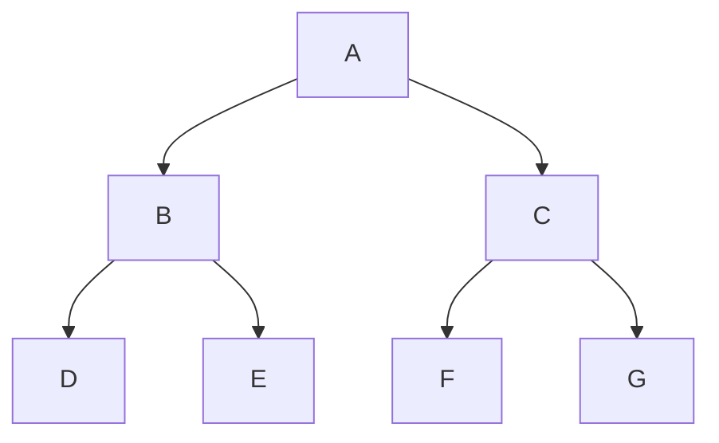
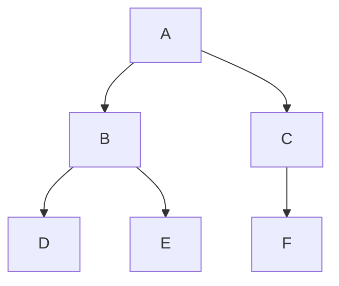
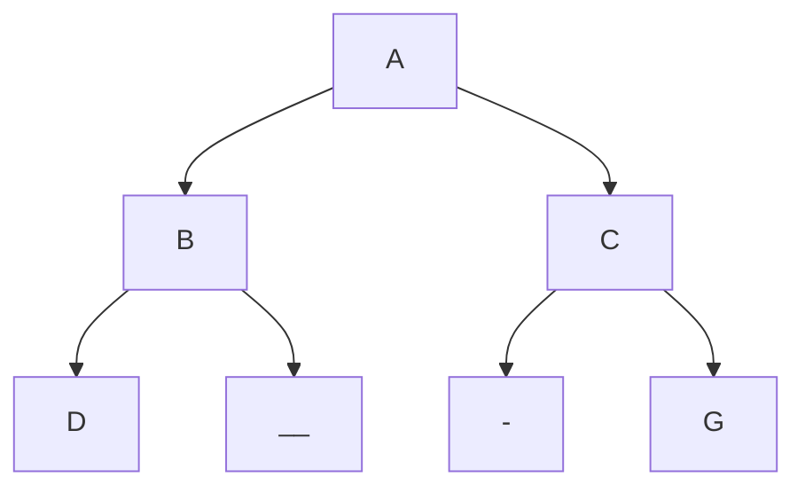
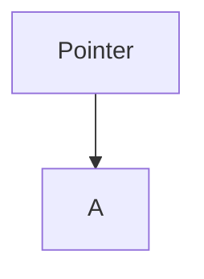
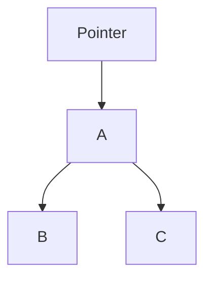
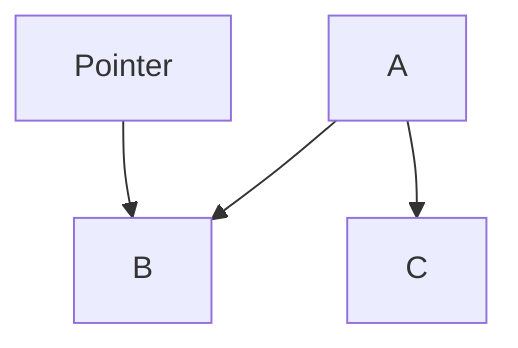

## Array Representation vs List Representation
### 1-Array Representation


you can form an array with elements in this order 
	`A , B , C , D , E , F , G , H`

where properties are

| Node | index | Left Child | Right Child |
| ---- | ----- | ---------- | ----------- |
| A    | 1     | 2          | 3           |
| B    | 2     | 4          | 5           |
| C    | 3     | 6          | 7           |
Notice that the children of node are always indexed = 2n& 2n+1


### 2-List Representation
by using doubly list structure
- we don't say linked list because linked assumes the nodes are linear
- the last level nodes have null pointers in its nodes (Node *l_child , Node *r_child)
- number of null pointers is = no of nodes +1 
		same as external = 1+ internal

## Full vs Complete vs non-Complete binary tree


you can form an array with elements in this order 
	`A , B , C , D , E , F , G `
	so this is a full binary tree because for height h all nodes are present




you can form an array with elements in this order 
	`A , B , C , D , E , F `
	this is a complete but not a full binary tree




you can form an array with elements in this order 
	`A , B , C , D , - , - ,G `
	this is not a complete binary tree
	it has 2 missing elements

Complete binary tree is a full tree to height `h-1` 
and is filled from left to right in level h

### Only Full  Or Complete binary tree is suitable for array representation because it doesn't have blank elements
- a full binary tree is always a complete binary tree
- a complete binary tree is not necessarily a full binary tree
- reminder: a strict binary tree is one where each node has 0 or 2 children

# Traversing a tree
using 4 methods:
1. Pre-order : Visit (node) , pre-order(left subtree) , pre-order(right subtree)
2. In-order: In-order(left subtree) , visit(node) , visit(right subtree)
3. Post-order: post-order(left) , post-order(right) , visit(node)
4. level order:  visit nodes level by level
example:


Pre-Order Traversing 
	`A , (B , D , E) , (C , F , G)`
In-Order Traversing
	`(D , B , E) , A , (F , C , G)`
Post-Order Traversing
	`(D , E , B) , ( F , G , C) , A`
Level Order Traversing
	`A , B , C , D , E , F , G`
-> These are traverser for the trees, however when given element of a tree , it's hard to find out its traverser type from its elements hence we user certain methods

![[Trees Representation-20240528002735758.webp]]
Another easy method is using your hands
- pointing to left for pre-order
- pointing upwards for in-order
- pointing to left for post-order
# Creating a tree using list representation

by making a queue and inserting addresses of nodes by order of creation 
steps:
- create node and assign data (data = A)
- insert address of A in the queue
  
| A   |     |     |     |
| --- | --- | --- | --- |
- pop out address of  A from queue and assign to a pointer

- is there left child to A ? YES
- create node of  B and put address of B in the Queue

| ~~A~~ | B   |     |     |     |
| ----- | --- | --- | --- | --- |
- is there right child to A ? yes
- create node of B and put address of B in the Queue


| ~~A~~ | B   | C   |     |     |
| ----- | --- | --- | --- | --- |
- now pop out B and assign to pointer and ask same question (left child and right child)


| ~~A~~ | ~~B~~ | C   |     |     |
| ----- | ----- | --- | --- | --- |
- continue for all nodes of tree
### Code for tree (1st Implementation using Queue)
```
#include <stdio.h>
#include <stdlib.h>
#include <stdbool.h>
#include <assert.h>

typedef struct Node{
    int data;
    struct Node *lchild;
    struct Node *rchild;
}Node;

typedef struct queue{
    Node **q; //array of pointers to struct node
    int front;
    int rear;
    int size;
}queue;

void createQ(queue **q, int _size){
    *q = (queue*)malloc(sizeof(queue));
    assert(*q);
    (*q)->front = 0;
    (*q)->rear = 0;
    (*q)->size = _size;
    (*q)->q = (Node**)malloc(_size * sizeof(Node*));
}

bool isFull(queue *q){
    if((q->rear+1)%q->size == q->front%q->size)
        return true;
    return false;
}

bool isEmpty(queue *q){
    if((q->rear)%q->size == q->front%q->size)
        return true;
    return false;
}

void enqueue(queue *q, Node* data){
    if(isFull(q)){
        printf("can not enqueue cause full\n");
    }
    else{
        q->rear = q->rear + 1;
        q->q[(q->rear)] = data;
    }
}

Node *dequeue(queue *q){
    Node *ret = NULL;
    if(isEmpty(q)){
        printf("can not dequeue cause empty\n");
    }
    else{
        ret = q->q[1 + q->front++];
    }
    return ret;
}

void createTree(Node **head){
    
    queue *q;
    createQ(&q , 100);
    Node *ptr , *tmp;
    int tmpData;
    /*get value of node data from user*/
    printf("Please enter value of Node: ");
    scanf("%d" , &tmpData);    while(getchar() != '\n');
    /*create node and assign data to it and assign NULLs to the rchid and lchild*/
    *head = (Node *)malloc(sizeof(Node));
    assert(*head);
    (*head)->data = tmpData;
    (*head)->lchild = (*head)->rchild = NULL;
    /*add to queue and then start while loop of checking for children and making nodes with hep of temporary pointers*/
    enqueue(q , *head);
    while(isEmpty(q) == false)
    {
        ptr = dequeue(q);
        /*test for existance of lchild (!= -1) and if so assign and add to queue*/
        printf("Please enter value of lchild of %d: " , ptr->data);
        scanf("%d" , &tmpData);     while(getchar() != '\n');
        if(tmpData != -1){
            ptr->lchild = (Node*)malloc(sizeof(Node));
            assert(ptr->lchild);
            ptr->lchild->data = tmpData;
            ptr->lchild->lchild = ptr->lchild->rchild = NULL;
            enqueue(q, ptr->lchild);
        }
        printf("Please enter value of rchild of %d: " , ptr->data);
        scanf("%d" , &tmpData);     while(getchar() != '\n');
        if(tmpData != -1){
            ptr->rchild = (Node*)malloc(sizeof(Node));
            assert(ptr->rchild);
            ptr->rchild->data = tmpData;
            ptr->rchild->lchild = ptr->rchild->rchild = NULL;
            enqueue(q, ptr->rchild);
        }
    }
    return;
}

void preOrderTree(Node *pNode){
    if(pNode){
        printf("%d\t" , pNode->data);
        preOrderTree(pNode->lchild);
        preOrderTree(pNode->rchild);
    }
    return;
}

void inOrderTree(Node *pNode){
    if(pNode){
        inOrderTree(pNode->lchild);
        printf("%d\t" , pNode->data);
        inOrderTree(pNode->rchild);
    }
    return;
}

void postOrderTree(Node *pNode){
    if(pNode){
        postOrderTree(pNode->lchild);
        postOrderTree(pNode->rchild);
        printf("%d\t" , pNode->data);
    }
    return;
}

int main(){
    struct Node *head;
    createTree(&head);
    preOrderTree(head);
    puts("");
    inOrderTree(head);
    puts("");
    postOrderTree(head);
    puts("");

    return 0;
}
```

### Traversals can be coded in two ways
### Recursive traversals
is very easy and it is the natural way of writing these traversals
```
void preOrderTree(Node *pNode){
    if(pNode){
        printf("%d\t" , pNode->data);
        preOrderTree(pNode->lchild);
        preOrderTree(pNode->rchild);
    }
    return;
}

void inOrderTree(Node *pNode){
    if(pNode){
        inOrderTree(pNode->lchild);
        printf("%d\t" , pNode->data);
        inOrderTree(pNode->rchild);
    }
    return;
}

void postOrderTree(Node *pNode){
    if(pNode){
        postOrderTree(pNode->lchild);
        postOrderTree(pNode->rchild);
        printf("%d\t" , pNode->data);
    }
    return;
}
```
### Iterative Traversals
Iterative traversals can't be written, but why ?
because of we assign a pointer to the left child and then we want to go back to the main node to go the right child we cannot "GO BACK"
so we need to use a stack.
- we use a stack to store the address of the node before we go to its left child, so after we finish we can pop the address and go to its right child
#### Code for iterative preorder traversal using stack (use with above code)
```

typedef struct Stack{
    int top;
    Node **array;
    int size;
}Stack;
Stack * createStack(int size){
    Stack *pStack = (Stack*)malloc(sizeof(Stack));
    assert(pStack);
    pStack->size = size;
    pStack->top = -1;
    pStack->array = (Node**)malloc(size * sizeof(Node*));
}
bool isStackEmpty(Stack *pStack){
    return (-1 == pStack->top);
}
bool isStackFull(Stack *pStack){
    return (pStack->top == pStack->size -1);
}
void pushStack(Stack *pStack , Node *data){
    if(isStackFull(pStack)){
        puts("OVERFLOW !!");
    }
    else{
        pStack->top++;
        pStack->array[pStack->top] = data;
    }
}
Node *popStack(Stack *pStack){
    if(isStackEmpty(pStack)){
        puts("UNDERFLOW !!");
        return NULL;
    }
    else{
        Node *pNode = pStack->array[pStack->top];
        pStack->top--;
        return pNode;
    }
}

void iterativePreOrder(Node *pNode){
    /*create stack to hold the addresses of nodes to be able to get back to them later*/
    Stack *pStack = createStack(STACKSIZE);
    /*as long as pointer is a valid node or the stack still has valid nodes */
    while(pNode || !isStackEmpty(pStack)){
        /*if pointer to node is not null , print value of node and navigate to left child*/
        if(pNode != NULL){
            printf("%d\t" , pNode->data);
            pushStack(pStack,  pNode); 
            pNode = pNode->lchild;
        }
        /*if pointer to node is null , pop stack into pointer and navigate to right child*/
        else{
            pNode = popStack(pStack);
            pNode = pNode->rchild;
        }
    }
}
```

#### Code for Tree Data structural with Recursive traversal and iterative traversals
```
#include <stdio.h>
#include <stdlib.h>
#include <stdbool.h>
#include <assert.h>

#define STACKSIZE 100

typedef struct Node{
    int data;
    struct Node *lchild;
    struct Node *rchild;
}Node;

typedef struct queue{
    Node **q; //array of pointers to struct node
    int front;
    int rear;
    int size;
}queue;

void createQ(queue **q, int _size){
    *q = (queue*)malloc(sizeof(queue));
    assert(*q);
    (*q)->front = 0;
    (*q)->rear = 0;
    (*q)->size = _size;
    (*q)->q = (Node**)malloc(_size * sizeof(Node*));
}

bool isFull(queue *q){
    if((q->rear+1)%q->size == q->front%q->size)
        return true;
    return false;
}

bool isEmpty(queue *q){
    if((q->rear)%q->size == q->front%q->size)
        return true;
    return false;
}

void enqueue(queue *q, Node* data){
    if(isFull(q)){
        printf("can not enqueue cause full\n");
    }
    else{
        q->rear = q->rear + 1;
        q->q[(q->rear)] = data;
    }
}

Node *dequeue(queue *q){
    Node *ret = NULL;
    if(isEmpty(q)){
        printf("can not dequeue cause empty\n");
    }
    else{
        ret = q->q[1 + q->front++];
    }
    return ret;
}

void createTree(Node **head){
    
    queue *q;
    createQ(&q , 100);
    Node *ptr , *tmp;
    int tmpData;
    /*get value of node data from user*/
    printf("Please enter value of Node: ");
    scanf("%d" , &tmpData);    while(getchar() != '\n');
    /*create node and assign data to it and assign NULLs to the rchid and lchild*/
    *head = (Node *)malloc(sizeof(Node));
    assert(*head);
    (*head)->data = tmpData;
    (*head)->lchild = (*head)->rchild = NULL;
    /*add to queue and then start while loop of checking for children and making nodes with hep of temporary pointers*/
    enqueue(q , *head);
    while(isEmpty(q) == false)
    {
        ptr = dequeue(q);
        /*test for existance of lchild (!= -1) and if so assign and add to queue*/
        printf("Please enter value of lchild of %d: " , ptr->data);
        scanf("%d" , &tmpData);     while(getchar() != '\n');
        if(tmpData != -1){
            ptr->lchild = (Node*)malloc(sizeof(Node));
            assert(ptr->lchild);
            ptr->lchild->data = tmpData;
            ptr->lchild->lchild = ptr->lchild->rchild = NULL;
            enqueue(q, ptr->lchild);
        }
        printf("Please enter value of rchild of %d: " , ptr->data);
        scanf("%d" , &tmpData);     while(getchar() != '\n');
        if(tmpData != -1){
            ptr->rchild = (Node*)malloc(sizeof(Node));
            assert(ptr->rchild);
            ptr->rchild->data = tmpData;
            ptr->rchild->lchild = ptr->rchild->rchild = NULL;
            enqueue(q, ptr->rchild);
        }
    }
    return;
}

void preOrderTree(Node *pNode){
    if(pNode){
        printf("%d\t" , pNode->data);
        preOrderTree(pNode->lchild);
        preOrderTree(pNode->rchild);
    }
    return;
}

void inOrderTree(Node *pNode){
    if(pNode){
        inOrderTree(pNode->lchild);
        printf("%d\t" , pNode->data);
        inOrderTree(pNode->rchild);
    }
    return;
}

void postOrderTree(Node *pNode){
    if(pNode){
        postOrderTree(pNode->lchild);
        postOrderTree(pNode->rchild);
        printf("%d\t" , pNode->data);
    }
    return;
}


typedef struct Stack{
    int top;
    Node **array;
    int size;
}Stack;
Stack * createStack(int size){
    Stack *pStack = (Stack*)malloc(sizeof(Stack));
    assert(pStack);
    pStack->size = size;
    pStack->top = -1;
    pStack->array = (Node**)malloc(size * sizeof(Node*));
}
bool isStackEmpty(Stack *pStack){
    return (-1 == pStack->top);
}
bool isStackFull(Stack *pStack){
    return (pStack->top == pStack->size -1);
}
void pushStack(Stack *pStack , Node *data){
    if(isStackFull(pStack)){
        puts("OVERFLOW !!");
    }
    else{
        pStack->top++;
        pStack->array[pStack->top] = data;
    }
}
Node *popStack(Stack *pStack){
    if(isStackEmpty(pStack)){
        puts("UNDERFLOW !!");
        return NULL;
    }
    else{
        Node *pNode = pStack->array[pStack->top];
        pStack->top--;
        return pNode;
    }
}

void iterativePreOrder(Node *pNode){
    /*create stack to hold the addresses of nodes to be able to get back to them later*/
    Stack *pStack = createStack(STACKSIZE);
    /*as long as pointer is a valid node or the stack still has valid nodes */
    while(pNode || !isStackEmpty(pStack)){
        /*if pointer to node is not null , print value of node and navigate to left child*/
        if(pNode != NULL){
            printf("%d\t" , pNode->data);
            pushStack(pStack,  pNode); 
            pNode = pNode->lchild;
        }
        /*if pointer to node is null , pop stack into pointer and navigate to right child*/
        else{
            pNode = popStack(pStack);
            pNode = pNode->rchild;
        }
    }
}

void iterativeInOrder(Node *pNode){
    /*create stack to hold the addresses of nodes to be able to get back to them later*/
    Stack *pStack = createStack(STACKSIZE);
    /*as long as pointer is a valid node or the stack still has valid nodes */
    while(pNode || !isStackEmpty(pStack)){
        /*if pointer to node is not null , navigate to left child*/
        if(pNode != NULL){
            pushStack(pStack,  pNode); 
            pNode = pNode->lchild;
        }
        /*if pointer to node is null , pop stack into pointer , print value and navigate to right child*/
        else{
            pNode = popStack(pStack);
            printf("%d\t" , pNode->data);
            pNode = pNode->rchild;
        }
    }
}

/* problem with post order is how to know that the node popped from stack is resulting from push of a 
right child ???*/

/*a quick solution is adding a 1 to the address in case it was being pushed after right child call
like if it was an indication of thumb instruction */

void iterativePostOrder(Node *pNode){
    /*create stack to hold the addresses of nodes to be able to get back to them later*/
    Stack *pStack = createStack(STACKSIZE);
    /*as long as pointer is a valid node or the stack still has valid nodes */
    while(pNode || !isStackEmpty(pStack)){
        /*if pointer to node is not null , navigate to left child*/
        if(pNode != NULL){
            pushStack(pStack,  pNode); 
            pNode = pNode->lchild;
        }
        /*if pointer to node is null , pop stack into pointer , print value and navigate to right child*/
        else{
            pNode = popStack(pStack);
            if((long long int)pNode %2 == 0){
                pushStack(pStack,   (Node*)((long long int)pNode +1)); 
                pNode = pNode->rchild;
            }
            else if ( (long long int)pNode %2 == 1 ){
                pNode = (Node*)((long long int)pNode -1);
                printf("%d\t" , pNode->data);
                pNode = NULL;
            }
        }
    }
}


int main(){
    struct Node *head;
    createTree(&head);
    puts("Recursive preorder traversing:");
    preOrderTree(head);
    puts("");
    puts("Recursive inorder traversing:");
    inOrderTree(head);
    puts("");
    puts("Recursive postorder traversing:");
    postOrderTree(head);
    puts("");

    puts("=====================================");
    puts("iterative preOrder Traversing :");
    iterativePreOrder(head);
    puts("");
    puts("iterative inOrder Traversing :");
    iterativeInOrder(head);
    puts("");
    puts("iterative Order Traversing : ");
    iterativePostOrder(head);
    return 0;
}
```