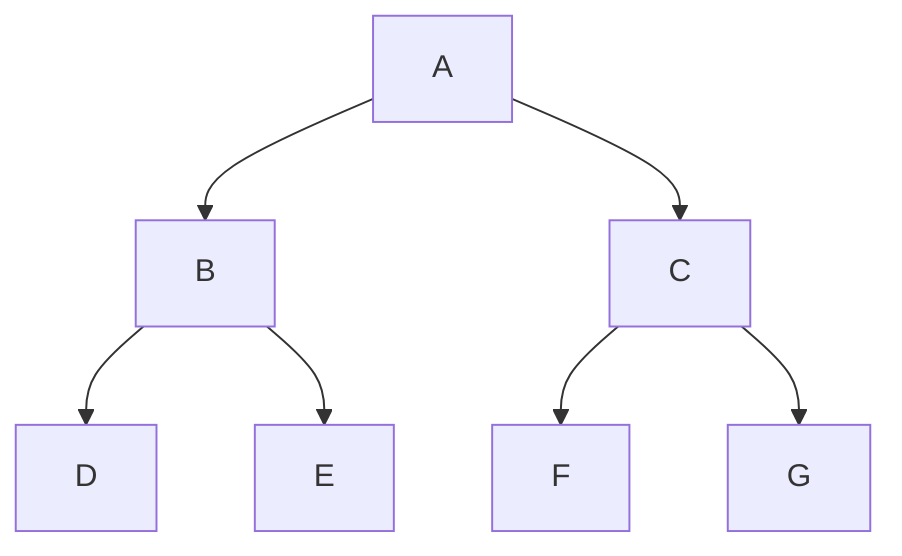
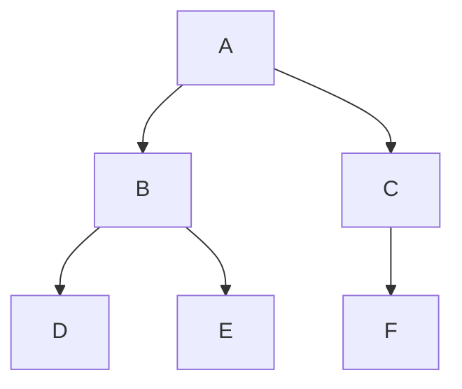
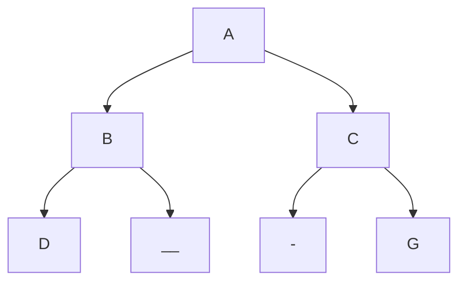

## Array Representation vs List Representation
### 1-Array Representation

you can form an array with elements in this order 
	`A , B , C , D , E , F , G , H`

where properties are

| Node | index | Left Child | Right Child |
| ---- | ----- | ---------- | ----------- |
| A    | 1     | 2          | 3           |
| B    | 2     | 4          | 5           |
| C    | 3     | 6          | 7           |
Notice that the children of node are always indexed = 2n& 2n+1

### 2-List Representation
by using doubly list structure
- we don't say linked list because linked assumes the nodes are linear
- the last level nodes have null pointers in its nodes (Node *l_child , Node *r_child)
- number of null pointers is = no of nodes +1 
		same as external = 1+ internal

## Full vs Complete vs non-Complete binary tree

you can form an array with elements in this order 
	`A , B , C , D , E , F , G `
	so this is a full binary tree because for height h all nodes are present

you can form an array with elements in this order 
	`A , B , C , D , E , F `
	this is a complete but not a full binary tree

you can form an array with elements in this order 
	`A , B , C , D , - , - ,G `
	this is not a complete binary tree
	it has 2 missing elements

Complete binary tree is a full tree to height `h-1` 
and is filled from left to right in level h

### Only Full  Or Complete binary tree is suitable for array representation because it doesn't have blank elements
- a full binary tree is always a complete binary tree
- a complete binary tree is not necessarily a full binary tree
- reminder: a strict binary tree is one where each node has 0 or 2 children

# Traversing a tree
using 4 methods:
1. Pre-order : Visit (node) , pre-order(left subtree) , pre-order(right subtree)
2. In-order: In-order(left subtree) , visit(node) , visit(right subtree)
3. Post-order: post-order(left) , post-order(right) , visit(node)
4. level order:  visit nodes level by level
example:

Pre-Order Traversing 
	`A , (B , D , E) , (C , F , G)`
In-Order Traversing
	`(D , B , E) , A , (F , C , G)`
Post-Order Traversing
	`(D , E , B) , (C , F , G) , A`
Level Order Traversing
	`A , B , C , D , E , F , G`
-> These are traverser for the trees, however when given element of a tree , it's hard to find out its traverser type from its elements hence we user certain methods

![[Trees Representation-20240528002735758.webp]]
Another easy method is using your hands
- pointing to left for pre-order
- pointing upwards for in-order
- pointing to left for post-order